# gh-Jeeves

**Objective:** The Bob Fleet GIT chair is a deterministic Windows service that processes GitHub events through to worker ACK/DONE and queue supersede with scripts only.

## KEY success metric

> **The Jeeves service must be able to process GIT announcements through to workers WITHOUT tokens.**

With every LLM/token pool disabled, this chain must complete with **scripts only**:

1. GitHub event → Bob GIT webhook  
2. Jeeves announces `GIT …` on `#bobiverse` and updates the queue (supersede rules)  
3. Worker `!bored` in its own `#{machine}` (on join and after DONE)  
4. **Jeeves assigns** the next job (`<nick>: <TYPE> <repo>#<n> <url>`, `!focus` order)  
5. Worker `ACK` → Jeeves marks accepted + busy  
6. Worker does the task (only step where AI is allowed)  
7. Worker `DONE` → Jeeves marks done + idle + supersede; worker `!bored` again  

**Resync:** on service start (FR #49) loads \queue.json\ then GitHub resync so \!list\ is full; every 15m thereafter. Token from env/file, never logged.

**G1** (CI, every PR): local test ircd E2E with no-LLM guard (plain + **TLS path**, FR #46). **G2** (after deploy): live smoke including native TLS to Ergo. A release is not shippable without both. Full definition: `docs/brief/JEEVES_BRIEF.md` §0.

**IRC client:** gh-Jeeves owns a **native TLS IRC client** (`jeeves.tls_irc`) for the chair. It does **not** import or spawn `agentic_irc` `irc_agent --chair`. Production: `python -m jeeves chair --tls --host irc.ntsa.uk --port 6697`.

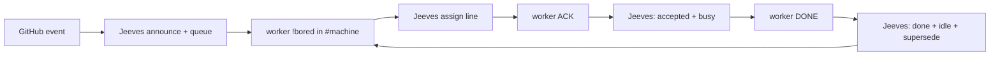

*Caption: the token-less chain that the acceptance gate proves (FR #106). Every box is a script except the worker's own work between ACK and DONE.*

## CAST IRON rules

**Install (FR #48):** `config/bobjeeves.example.json` drives `Install-BobJeeves.ps1` — full `--host/--port/--tls` cmdline, receiver **19781**, **no BobIrcd dependency**, topology **combined** chair+receiver.

**Modes (FR #52 / #160):** authenticated `bob-*` get `+h` (`+o` in own shop); authenticated `simon` from a fleet host gets `+o`. Trust is services account (SASL), never nick alone. No channel text. Ergo has no runtime SAIDENTIFY/auto-OPER for Simon — Halloy needs SASL/PASS/CERTFP; see `docs/simon-auto-oper-runtime-fr160.md`.

**Channel join (FR #55):** on connect and reconnect Jeeves sends LIST and JOINs every channel returned (skips 0/+ local and config denylist). Periodic re-LIST (default 60s) joins newly created shops. KICK rejoins with backoff; ban/invite-only logs once and stops. Static shops is optional seed only.

1. Announce only on `#bobiverse`; queue on digest webhook.  
2. In every `#{machine}`: `!bored` → assign; ACK → accepted+busy; DONE → done+idle+supersede (FR #106).  
3. **Jeeves owns `!bored` → assign** (ear OFFER path retired). One line: `<nick>: <TYPE> <repo>#<n> <url>`.  
4. Workers stay in their own shop; only `{machine}-<pid>` `!bored` is trusted.  
5. Deterministic scripts-only path (works during token outage / Sand empty).  
6. Supersede: FR↔MRB↔UAT per GitHub events (see diagrams).  
7. MRB PASS closes FR; FAIL one fix PR, FR stays open; only Bob stamps UAT. Self-MRB only when one live seat.
   **FR #151:** agent-submitted issues need **MRB #1** (Simon vision fit: `needs-mrb1` → `mrb1-pass`) before engineering.
   **FR #92 / MRB #2:** PR body needs `Seat: {nick}`. Reviewing seat posts required check **`mrb/verdict`** via
   `tools/post_mrb_verdict.py` (full `pytest tests/`, duration ≥ 10 min, reviewer ≠ author).
   See `docs/mrb-gates.md` and `docs/mrb-enforcement.md`. Simon may admin-override.  
8. `!list` in channel or PM → queue by PM only (`all`/`repo` filters; no silent cap).  
9. Own Windows service; never touch Ergo/BobIrcd.  
10. Busy/idle from ACK/DONE, not from TUI appearance.  
11. `!ignore` / `!unignore` / `!ignored` (FR #75): suppress a repo from the whole Jeeves process (no announce, queue, `!list`, or assign). List persists in `ignored.json` beside `queue.json`. Simon (account) or `bob-*` ops mutate; `!ignored` is open.  
12. `!focus` / `!unfocus` (FR #68 / #141 / #154): simon (services account) sets repo priority for `!list` and Jeeves assign-on-`!bored` (same sort). `high`/`medium`/`low` = 1/5/9; bare `!focus {repo}` = high. `!focus strict on|off` persists in `focus.json`. Digest exposes `focus` (list) and additive `focus_strict` (boolean).

Details: `docs/functional-spec.md`, `docs/vision.md`.

## Scope

**Owns:** announce chair, queue+supersede, shop ACK/DONE listener, `!list`, webhook writer, GIT receiver, `BobJeeves` installer, G1 tests, docs, `skills/` overlay.

**Does not own:** LLM features, Ergo config, TipForm UI, worker packs (agentic_irc / agentic_build / AgentMonitor). Assign-on-`!bored` is owned here (FR #106).

Migration: `docs/migration-plan.md`. Vision input: `docs/brief/JEEVES_BRIEF.md`.

## Skills (agent overlay)

`skills/` is the agent-controllable surface (install, health, queue, announce debug, worker state, release, token-less gate, harvest). **Agentic control is an overlay:** the token-less path must never depend on a skill or an LLM. See `skills/README.md`. Honesty box: `skills/harvest` and `.grok/skills/harvest-agent-skills`.

---

## Diagrams

One diagram per concern (~5–9 nodes). Index first; then lifecycle; then deployment/recovery.

### Index

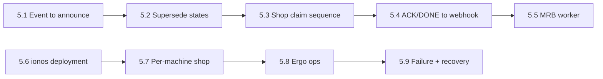

*Caption: the map of the diagrams below. Top row is the job lifecycle; bottom row is where things run and how they recover.*

### GitHub event → Jeeves announce

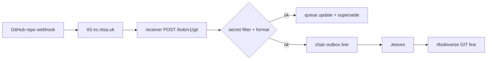

*Caption: one GitHub event becomes one `GIT …` line on #bobiverse and one queue change, with no LLM involved.*

### Queue supersede rules

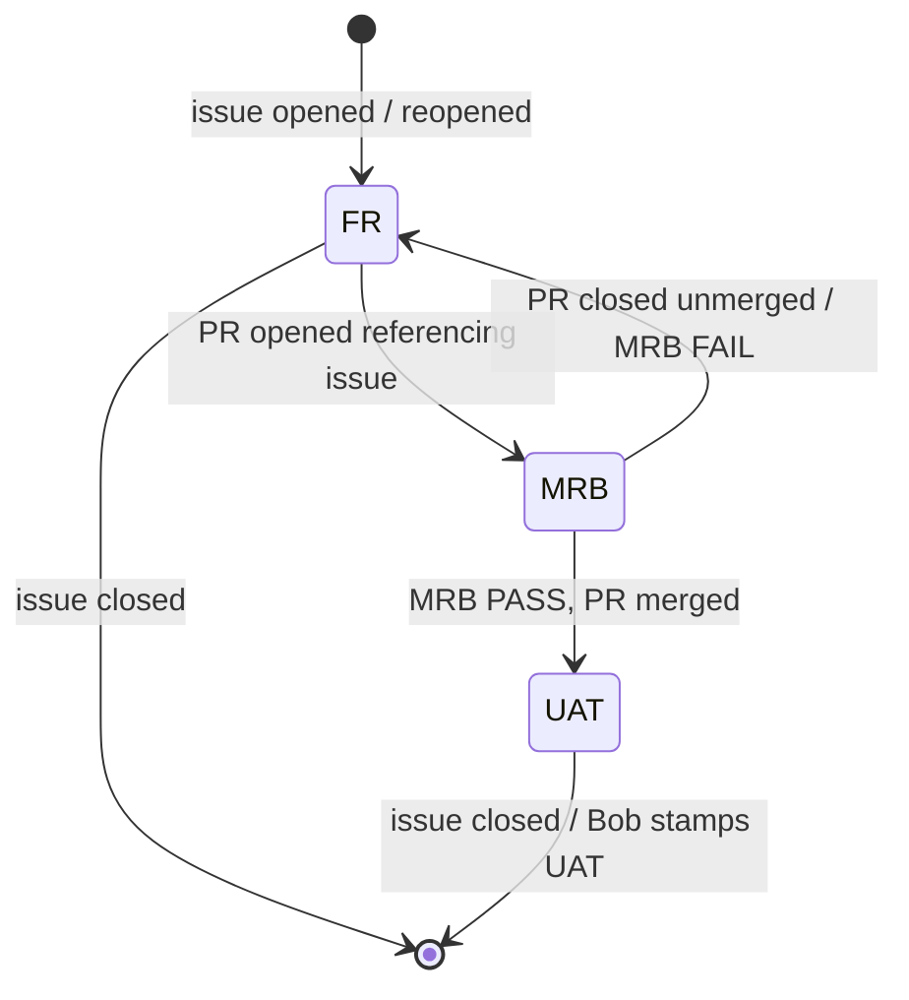

*Caption: the queue holds only the current task per piece of work, and each GitHub event replaces it deterministically.*

### Shop claim: !bored → Jeeves assign → ACK (FR #106)

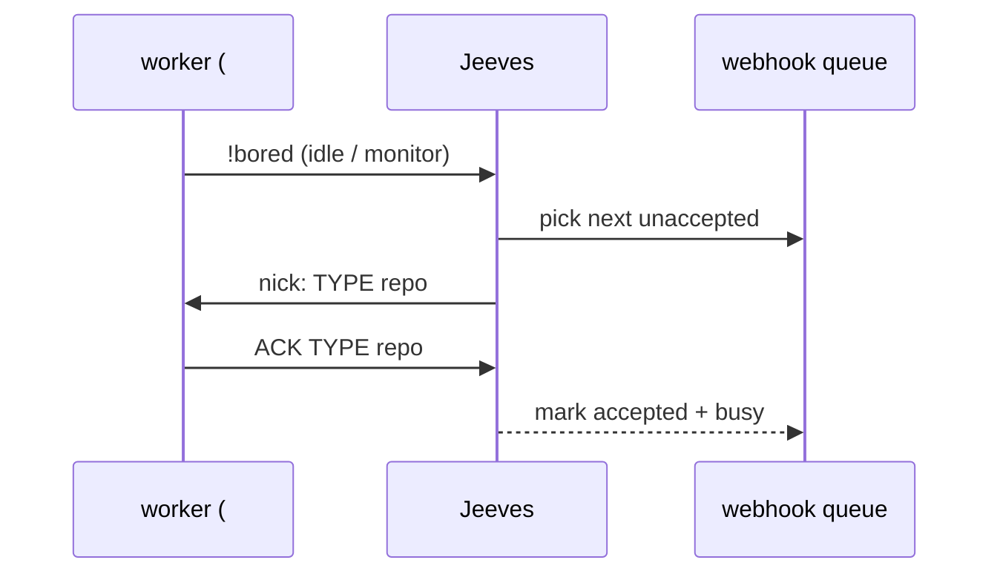

*Caption: Jeeves assigns on !bored; the worker ACKs in #machine (ear OFFER retired).*

### ACK/DONE → webhook busy/idle

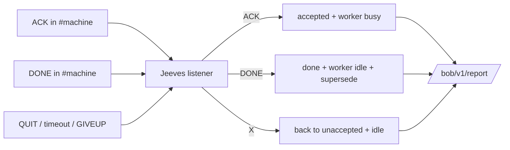

*Caption: Jeeves is the single deterministic writer of worker busy/idle, taken from shop lines.*

### MRB worker process

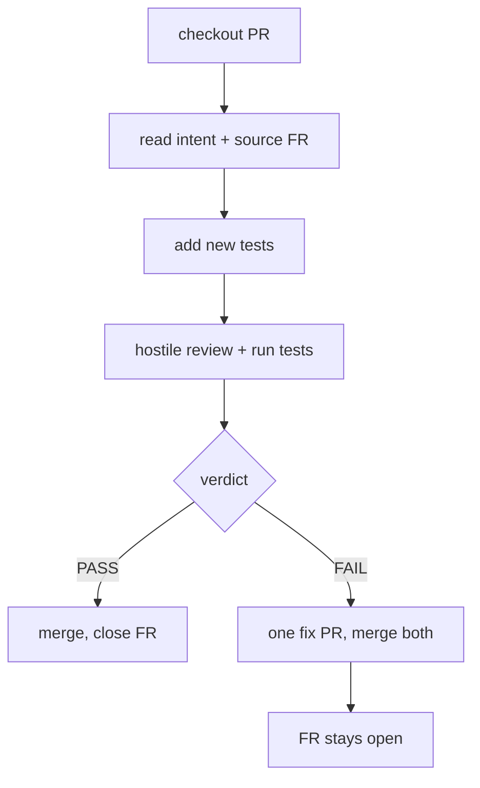

*Caption: the standard MRB transaction; only Bob stamps UAT after a separate UAT worker.*

### Deployment on ionos

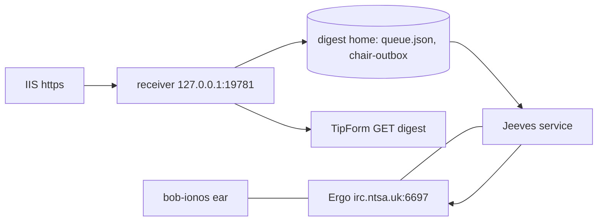

*Caption: what runs on ionos. Ergo, Jeeves, the receiver and the ionos ear share one host but are separate processes.*

### Per-machine shop

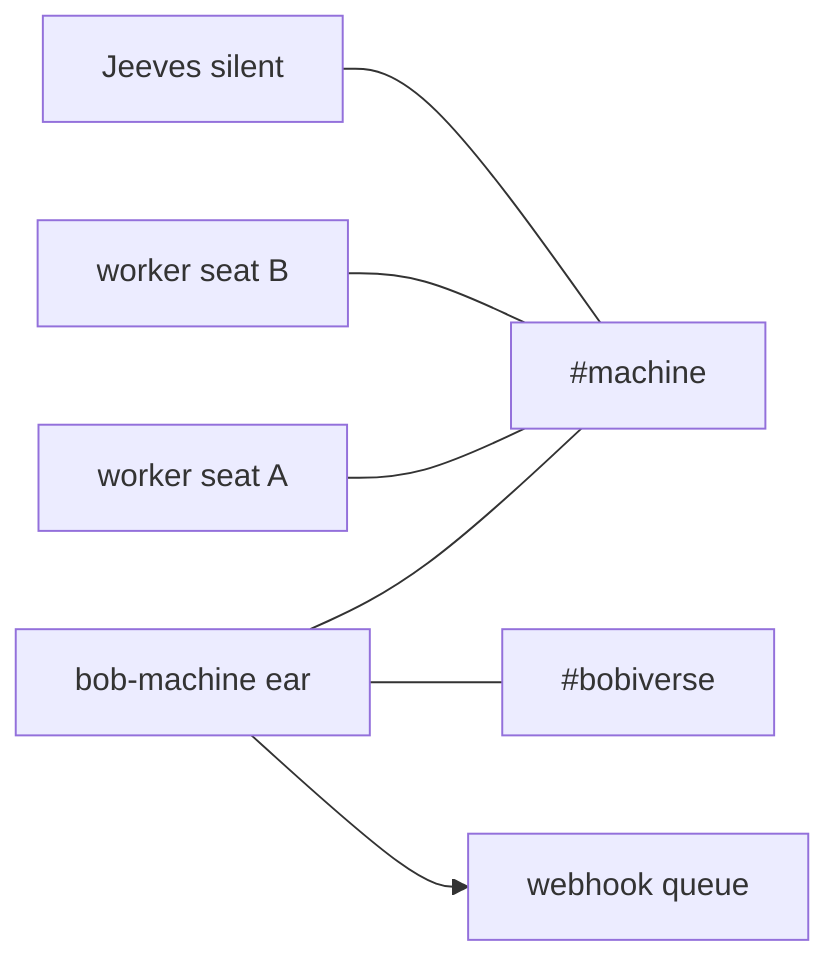

*Caption: each machine's shop holds its ear, its own workers and a silent Jeeves; only the ear also sits in #bobiverse.*

### Ergo ops and channel registration

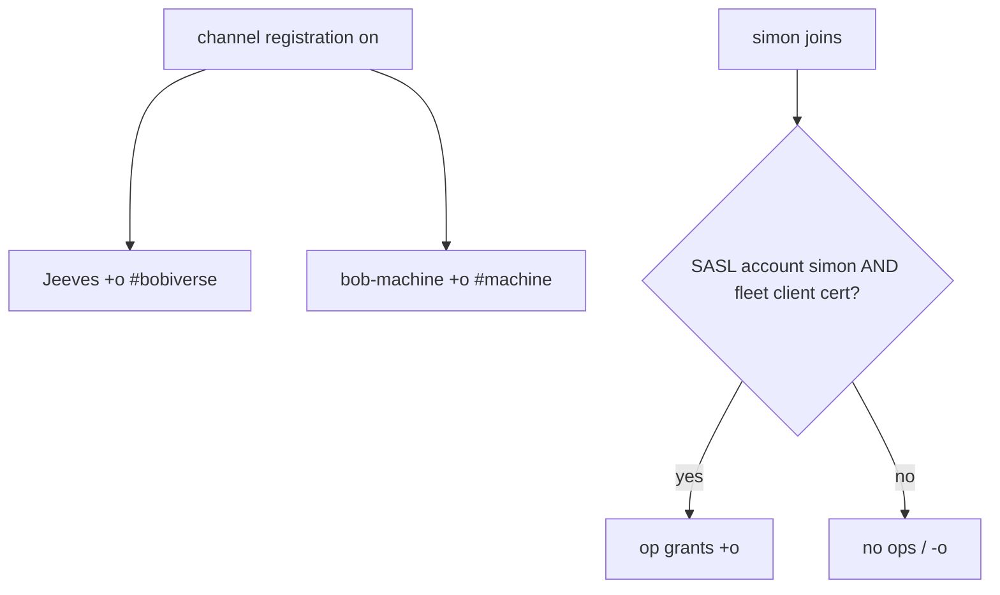

*Caption: durable bot ops come from Ergo registration; simon gets ops only from a fleet machine's own client certificate (agentic_build #327).*

### Failure and recovery

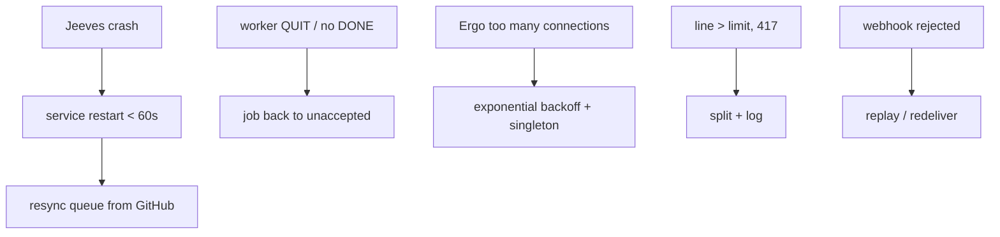

*Caption: every failure has a scripted recovery; none needs a human or an LLM.*

---

## Repo layout

| Path | Role |
|------|------|
| `docs/vision.md` | LOCKED vision pack |
| `docs/mocks/` | `!list`/health text wireframes (validator) |
| `docs/functional-spec.md` | LOCKED behaviour |
| `docs/brief/JEEVES_BRIEF.md` | Vision input (verbatim) |
| `docs/migration-plan.md` | Extract / cut-over phases |
| `skills/` | Agent overlay + harvest honesty box |
| `src/gh_jeeves/announce.py` | FR #24 length-safe GIT/OFFER/list lines (vital-first, byte budget) |
| `tests/test_announce_length_fr24.py` | FR #24 acceptance (token-less) |

## License / ownership

Public product under SimonBarnett. Plan seat created this repo with Bob GIT webhook `https://irc.ntsa.uk/bob/v1/git`.
