# gh-Jeeves: vision brief (Plan / visionary input)

Target repo: **SimonBarnett/gh-Jeeves**. Owner: Simon Barnett (Bob Fleet).
Brief assembled 2026-09-25 (BST) from the live sources listed in section 2. No secrets are included. Every credential, secret file and header value is referred to by role only (see section 17).

---

## 0. KEY SUCCESS METRIC (the acceptance gate; everything else is secondary)

> **"The Jeeves service must be able to process GIT announcements through to workers WITHOUT tokens."** (Simon)

### Measurable definition
Disable **every** LLM or token pool: no Grok, no Cursor, no OpenRouter, no Sand, no Bob LLM, no Copilot. Then this whole chain must complete with **scripts only**, with no human and no AI in the loop:

1. A GitHub event (issue opened or reopened; PR opened, merged or closed unmerged) is POSTed to the Bob GIT webhook.
2. **Jeeves** announces a `GIT …` line on **#bobiverse** and updates the task queue, applying the **supersede** rules (section 7).
3. A worker that has been idle for more than 2 minutes sends **`!bored`** in **its own `#{machine}`**.
4. The **bob-{machine} ear** offers the top unaccepted job addressed to that worker nick in `#{machine}`.
5. The worker sends **`ACK <TYPE> <owner/repo>#<n>`** in `#{machine}`.
6. **Jeeves** (a silent listener in `#{machine}`) marks the job **accepted** and sets that worker **busy** on the digest webhook.
7. The worker does the task. This is the **only** step where AI is allowed.
8. The worker sends **`DONE <TYPE> <owner/repo>#<n> <result> <url>`** in `#{machine}`.
9. **Jeeves** marks the job **done**, sets the worker **idle** on the webhook and applies **supersede** (for example, FR done with PR → MRB of the PR is queued).

### Gate
- **G1: token-less end-to-end test (CI, required for every PR).** Run the chain above against a **local test ircd** on loopback, with a local stub of the webhook receiver and a scripted fake worker. **Never live IRC.** Pass criteria:
  - Every step produces its expected wire line or state change within a bounded time.
  - `queue.json` and webhook state match the expected snapshot after each step.
  - A process-level guard proves no network call to any LLM or token endpoint happened (for example, the env for all AI keys is unset and any outbound HTTP except loopback fails the test).
- **G2: live smoke test (manual, after deploy; procedure in section 16.3).** Use a throwaway issue on a sandbox repo, with ears and workers configured with no token pools. Watch the announce, the queue row, `!bored`, the offer, ACK, busy, DONE, idle and supersede, using `irc.log` plus `GET https://irc.ntsa.uk/bob/v1/report`.
- A gh-Jeeves release is **not** shippable unless G1 is green and G2 has been run and recorded.

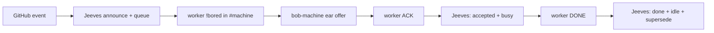
*Caption: the token-less chain that the acceptance gate proves. Every box is a script except the worker's own work between ACK and DONE.*

---

## 0.1 Known issues surfaced on 2026-09-25: the visionary MUST open each as a seed FR in gh-Jeeves

Evidence for each is in sections 4, 11, 12 and 18. Each FR needs a failing test first, then the fix. Items marked (blocks gate) must be done before the section 0 gate can pass.

| # | Issue | Evidence | Seed FR outcome |
|---|---|---|---|
| K1 | **The chair handles `!BORED` itself** and posts claims in shop channels, which breaks the rule that Jeeves never handles !bored or offers (blocks gate) | agentic_irc chair / `gitclaim.py` (section 4.4) | The bob-{machine} ear owns !bored and offers. Jeeves only listens for ACK/DONE (agentic_irc #211). |
| K2 | **The claim code ignores real worker nicks.** It accepts only `w-<short>-<pid>`, but the live seats are `{machine}-{pid}` (e.g. `marchhare-34992`) (blocks gate) | section 4.4, gap 1 | One nick grammar `{machine}-{pid}` for everything, with a test. |
| K3 | **Nothing is marked accepted:** 28 unaccepted and 0 accepted despite many ACKs (blocks gate) | ionos `queue.json`, section 4.3 | Accept on ACK, busy/idle on the webhook (#211 and its comment). |
| K4 | **Merged PRs stay queued** (skills-visionary #18/#20/#21, agentic_irc #201/#202, AgentMonitor #87, agentic_build #326) and there's no supersede; issues are labelled `PR` instead of FR (blocks gate) | section 4.3, section 7 | The supersede engine from #207 plus a GitHub resync/backfill; `reopened` gets queued. |
| K5 | **Jeeves and the receiver run old code** from `C:\ai\agentic_irc-www@ac4b575` (24 Sep), not main; bob-ionos is on a stale 22 Sep branch | section 4.3 | Deploy from a tagged gh-Jeeves release, with the running version reported to the webhook and a drift check. |
| K6 | **The `BobJeeves` service is Disabled** and Jeeves runs from the scheduled task `BobJeeves-chair` | section 4.3 | Jeeves as its own Windows service (agentic_build #330 / FR #7): `Install-BobJeeves.ps1 -Apply` sets **start= auto**, failure restart, and **Disable-ScheduledTask BobJeeves-chair**. |
| K7 | **The `BobIrcd` service shows Stopped while ergo.exe runs** outside it | section 4.3 | **Report only.** gh-Jeeves must not touch Ergo/BobIrcd; raise it for Simon in agentic_build. Jeeves health should detect the IRC server being down. |
| K8 | **The receiver launcher `BobReport-ionos` is ad hoc** (a script in the Administrator profile, not in any repo) | section 4.3, section 18 | gh-Jeeves (or agentic_build) owns the receiver service and installer. |
| K9 | **`config/bobiverse.json` has duplicate `reportUrl` keys** (with and without :7700) | section 4.2 | A single key (`https://irc.ntsa.uk/bob/v1/report`) plus `jeeves.config_lint` / FR #10 tests. |
| K10 | **Docs contradict the rules:** 3 agentic_build README diagrams and the `bob-token-efficient-handoff` skill say "Jeeves offers the job" | section 4.4 | Fix the docs and skills; gh-Jeeves README is the source of truth with small diagrams. **FR #11** + lint `tests/test_docs_k10_fr11.py`. |
| K11 | **ASSIGN has no owner:** no code sends it, so it was hand/LLM-sent via bob-marchhare. Several ASSIGNs were fired while the worker was busy, and multi-line assignments split into separate wakes (blocks gate) | sections 11, 12, 18 | A deterministic single-line OFFER from the ear, one item per worker, gated on busy state. |
| K12 | **Worker sessions look idle:** FROM payloads run as hidden `agent.exe -r <session> -p` processes, not in the visible seat | section 11 | Busy state on the webhook/TipForm from ACK/DONE; the worker pack echoes its task in the seat. **FR #13** sets `machines.<id>.working_on` from ACK/DONE (`tests/test_worker_busy_tipform_k12_fr13.py`); seat echo + TUI visibility: AgentMonitor #90. |
| K13 | **IRC reconnect storm:** irc_agent `PART :recv idle`, then the monitor relaunches every few seconds, then Ergo's "too many connections" throttle | section 11, section 5.9 | Reconnect in place with exponential backoff on the throttle ERROR (agentic_irc #210 area); Jeeves and the ears get the same. **FR #14** / #108: `TlsIrcClient.ensure_connected` retries forever with cap ~30s; success clears storm counters (`tests/test_reconnect_k13_fr14.py`). |
| K14 | **The receiver's secret filter rejects payloads** containing certain strings, so issues with them are never announced | agentic_irc #206 | Scan only the secret-bearing fields; test with this brief's text. |
| K15 | **"closes #N" in PR bodies closes the FR even on MRB FAIL** | gap 7 | The queue treats an issue closed by a merge whose MRB failed as still open (or the worker pack forbids closing keywords). |

## 0.2 Skills directory: Jeeves is agent-controllable (required)

gh-Jeeves ships a `skills/` directory (the same SKILL.md layout as the fleet skill books: `skills/<kebab-name>/SKILL.md` with frontmatter `name` and a "use this when ..." `description`) so any agent (Grok, Cursor, Aider, Grok Bot) can operate, diagnose and change Jeeves. Agentic control is an **overlay**: the section 0 token-less path must never depend on a skill or an LLM.

Seed skills (each is a seed FR with a test or lint that checks the skill exists and its commands run):
- **harvest** (REQUIRED): the honesty-box rule. Any agent that uses the gh-Jeeves skills and learns something new must PR it back to `SimonBarnett/gh-Jeeves/skills`, or open an issue/FR. It also covers harvesting into Jeeves from the other fleet skill books (agentic_build, agentic_irc, skills-visionary). It follows the same pattern as the fleet `bob-harvest-honesty-box` / `harvest-skills-visionary` skills, and is always auto-harvest.
- **jeeves-install-service**: install, repair or upgrade the Jeeves Windows service idempotently (#330); never touch Ergo/BobIrcd.
- **jeeves-health**: check the service, IRC presence in #bobiverse and every #{machine}, webhook lastSeen, version drift and throttle backoff.
- **jeeves-queue**: read, explain, resync, backfill and repair the queue (supersede rules, `!list`), with a dry-run-first rule for any manual edit.
- **jeeves-announce-debug**: a GitHub delivery isn't announced (hook deliveries, receiver secret filter #206, chair-outbox, 417 long lines).
- **jeeves-worker-state**: interpret ACK/DONE, busy/idle on the webhook, stale START tiles, stuck accepted items.
- **jeeves-release**: tag, deploy from a release, and roll back.
- **jeeves-token-less-gate**: run the section 0 end-to-end test (G1 local test ircd, G2 live smoke).

`skills/README.md` lists the skills, and the installer can copy `skills/` into agents' skill folders the same way Install-BobFleet does for the other books.

## 1. What Jeeves is (and is not)

- Jeeves is the fleet's **deterministic GIT chair**. It uses **no LLM**; it is 100% scripts. Nick `Jeeves` on the private Ergo server `irc.ntsa.uk:6697` (TLS), hosted on **ionos**.
- **Jeeves does:**
  - Announces GitHub webhook events as single `GIT …` lines on `#bobiverse` (bobs and Jeeves only).
  - Owns the **task queue** (unaccepted, accepted, done) on the digest webhook `https://irc.ntsa.uk/bob/v1/report`. The on-disk `queue.json` is only a crash mirror.
  - Sits **silently** in every `#{machine}` shop channel and records worker **ACK/DONE**, updating the queue and worker busy/idle on the webhook.
  - Answers **`!list`** by private message.
- **Jeeves never:**
  - handles `!bored`;
  - offers or assigns jobs;
  - posts in shop channels during normal operation;
  - reasons with an LLM.
- Jeeves is becoming **integral**: it is the critical path of the token-less fleet. So it moves out of `agentic_irc` into its own repo, **gh-Jeeves**, with its own service, tests and release cycle.

---

## 2. Sources consulted (real, not guessed)

| Source | Revision | Used for |
|---|---|---|
| `SimonBarnett/agentic_irc` main | `b3f904b` (2026-09-25 11:51 BST, merge #202) | `scripts/irc_agent.py` (chair), `scripts/gitclaim.py` (queue), `scripts/bobreport.py` (announce format, digest, `apply_git_webhook`, `apply_callback`), `scripts/bobcallback.py` (webhook receiver), `scripts/Install-BobChair.ps1`, `scripts/Register-BobChairTask.ps1`, `scripts/Start-BobEar.ps1`, `README.md`, `docs/bobiverse-ionos-ircd.md` |
| `SimonBarnett/agentic_build` main | `bbe2b0a` (2026-09-25 11:46 BST, merge #326) | `tools/Install-BobJeeves.ps1`, `tools/Start-BobJeeves.ps1`, `tools/Install-BobIrcd.ps1` (Ergo NSSM), `tools/Install-BobFleet.ps1`, `tools/Watch-BobTray.ps1` (TipForm tray + Plan menu), `tools/Watch-Bobiverse.ps1`, `tools/Close-BobSupersededGithub.ps1`, `tools/Bob-IrcTcpTestServer.ps1`, `src/Private/Get-BobIrc.ps1` (`Read-BobReportDigestHttp`), `src/Private/Invoke-BobGitAccept.ps1`, `config/bobiverse.json`, `README.md` (5 mermaids) |
| `SimonBarnett/AgentMonitor` main | shallow clone 2026-09-25 | `Watch-AgentHealth.ps1` (watch seat, FROM forwarding, ASSIGN wake), FRs #87–#91 |
| Grok Bot skills `/home/box/agent-data/workflows` | 2026-09-25 | bob-jeeves-chair, bob-git-accept-claim, bob-digest-webhook-fuel, bob-worker-activity-webhook, bob-token-efficient-handoff, bob-mrb-worker, connect-bobiverse, bob-harvest-honesty-box |
| ionos (read-only look, 12:00 BST) | live | scheduled tasks, services, processes, `~\.agentic-irc-bobiverse\queue.json`, `irc.log` `GIT` lines |
| GitHub API | live | FR/PR states (section 13); reference hook `club-madeira-onboarding` 685447057 |

---

## 3. CAST IRON rules (non-negotiable; gh-Jeeves must encode these as tests)

1. **Announce scope.** Jeeves announces GIT work **only on `#bobiverse`** (bobs and Jeeves only) and keeps the task queue on the **digest webhook** (`/bob/v1/report`).
2. **Silent shop listener.** Jeeves sits **silently** in every `#{machine}` shop channel and monitors worker lines:
   - **ACK**: the job is **accepted**, and Jeeves sets the worker **busy** on the webhook.
   - **DONE**: the job is **completed**, Jeeves sets the worker **idle** and applies **supersede**.
3. **No claiming.** Jeeves **never handles `!bored`** and **never offers**.
4. **Workers stay in their shop.**
   - Workers join **only their own `#{machine}`**, never `#bobiverse`.
   - A worker idle for **more than 2 minutes** sends **`!bored`** there.
   - The **bob-{machine} ear** offers the **top unaccepted job addressed to that nick** and takes the ACK.
5. **Deterministic path.** The announce → accepted-worker path is **fully deterministic**: scripts only, and it works during a token outage.
6. **Supersede rules:**
   - An FR with a PR becomes **MRB of the PR**.
   - MRB **PASS merged** becomes **UAT**.
   - A PR **closed unmerged** restores the FR.
   - An issue **closed** removes it.
   - An issue **reopened** re-adds the FR.
7. **MRB worker process.** Check out, read intent, add **new** tests, hostile review.
   - **PASS:** merge and **close the FR**.
   - **FAIL:** exactly **one** fix PR, merge **both**, and the FR **stays open**.
   - **Only Bob stamps UAT.**
8. **`!list`**, sent by PM, returns the unaccepted queue by PM.
9. **Ergo channel registration:**
   - `bob-{machine}` is op in `#{machine}`; `Jeeves` is op in `#bobiverse`.
   - `simon` gets ops **only** from a fleet machine, identified by a **per-machine client certificate** (the cloak is per public IP, not per machine).
10. **Jeeves runs as its own Windows service** (agentic_build #330).
11. **Worker sessions** (watch seat, AgentMonitor, FROM forwarding) must:
    - make busy/idle observable;
    - serialise wakes;
    - never be mistaken for idle while a hidden run is working (section 11).

---

## 4. Current state (as built today) and where it breaks the rules

### 4.1 Code map (agentic_irc)
- **`scripts/bobcallback.py`: the HTTP receiver.**
  - Behind IIS at `https://irc.ntsa.uk`. On ionos it listens on `127.0.0.1:19781`.
  - `POST /bob/v1/git`: GitHub webhook. It needs the `X-GitHub-Event` header, has no HMAC (the fleet hooks carry no secret) and returns 204.
  - `POST /bob/v1/report`: fleet writes, authenticated by a shared-secret header (value redacted). Ops: `merge`, `delete-worker`, `shop-down`, `git-claim`.
  - `GET/HEAD /bob/v1/report`, `/bob/v1/digest`, `/digest`: the public JSON digest, including `queue`.
  - A POST is only accepted from allow-listed IPs (default loopback).
- **`bobreport.apply_git_webhook`:**
  - Runs a secret-marker filter over the **whole payload**. This is gap #206: an issue that merely *mentions* a marker is rejected with 400 and never announced.
  - Formats the line with `format_github_webhook_announce`: `GIT <event> <owner/repo> [<action> #<n> <title≤120>] [by <actor>]`, max 380 characters. Push: `GIT push <repo> <branch> <sha12> N commit(s)`. Ping: `GIT ping <repo> <zen>`.
  - Enqueues a claim through `gitclaim.claim_from_payload`.
  - Appends `PRIVMSG #bobiverse :<line>` to `chair-outbox.txt` in the digest home.
- **`scripts/gitclaim.py`: the queue.**
  - `queue.json` has the shape `{v:1, unaccepted:[…], accepted:[…]}`. Each row is `{repo, task, id:"#n", ts, line, event, action, seq, [nick, channel, accepted_ts]}`. Accepted is capped at 200.
  - The map is **only** `issues/opened → PR`, `pull_request/opened|ready_for_review → MRB`.
  - Missing: reopened, closed, merged, supersede, done list, and FR naming. Issues are mislabelled `PR`.
  - `claim_top` pops the oldest row.
  - `bored_gate` has a 120 s idle rule and only accepts worker nicks shaped `w-<short>-<pid>` in their own shop.
- **`scripts/irc_agent.py --chair`: Jeeves.**
  - Joins `#bobiverse` plus every fleet shop (`bobreport.chair_channels()`: `#flamingo #marchhare #ionos #ce-priority-dev1`) and drains `chair-outbox.txt`.
  - **Today the chair handles `!BORED`** in shop channels: `_maybe_git_claim` → `_git_bored` → `claim_top_http` (POST `op=git-claim`) → posts `repo task id`, `NAK !BORED wait|busy` or `no jobs` in the shop. **This violates CAST IRON 3** and must move to the bob-{machine} ear.
  - `!ACCEPT` is a no-op. There is no ACK/DONE parsing and no `!list`.
- **Installers:**
  - `scripts/Install-BobChair.ps1` starts the chair with `--home ~\.agentic-irc-jeeves` and `BOB_DIGEST_HOME=~\.agentic-irc-bobiverse` (they must differ). It kills any prior `--chair` / `Jeeves`, clears a stale `agent.quit.request`, and reads the Ergo connect secret from the user profile (value redacted).
  - `scripts/Register-BobChairTask.ps1` registers scheduled task **`BobJeeves-chair`** (at logon plus a 1-minute repetition watchdog, IgnoreNew, as the chair user). The reason given: the DPAPI user-scope sealed identity and `icacls` fail under LocalSystem, so an NSSM service crash-loops.

### 4.2 Code map (agentic_build)
- `tools/Install-BobIrcd.ps1`: Ergo as NSSM service **`BobIrcd`** (`C:\ai\ergo`, `ircd.yaml`). It replaced the old `BobIrcd-ionos` task. **gh-Jeeves must never change Ergo or BobIrcd config.**
- `tools/Install-BobJeeves.ps1` / `tools/Start-BobJeeves.ps1`: NSSM service **`BobJeeves`**, which depends on BobIrcd and runs the same chair. It is superseded in practice by the scheduled task because of the DPAPI issue above.
- `tools/Install-BobFleet.ps1`:
  - Installs logon tasks per seat: `BobFleet-<machine>` (tray `Watch-BobTray.ps1`, the TipForm) and `_Watch-Bobiverse-<machine>` (the bob-{machine} ear through `Start-BobEar.ps1`).
  - Copies the skills.
  - No Windows services.
- TipForm consumes the digest (`Read-BobReportDigestHttp` → `Apply-BobIrcDigestCursorPools`). The tray's **Plan** menu launches Grok or Cursor in plan mode with only skills-visionary (`Install-VisionarySkills.ps1`).
- `config/bobiverse.json` has `chairNick: Jeeves`, `chairHome: ionos`. **Was:** two `reportUrl` keys (`:7700` and IIS HTTPS). **Now (FR #10 / K9):** single `reportUrl` `https://irc.ntsa.uk/bob/v1/report`; linted by `jeeves.config_lint`.
- `tools/Close-BobSupersededGithub.ps1` and `Close-BobMrbPassedIssues.ps1` handle supersede on GitHub (closing PRs and issues). They do not manage the queue.
- `tools/Bob-IrcTcpTestServer.ps1` is a minimal wire test server. gh-Jeeves needs a proper local test ircd (see #329).

### 4.3 Deployment on ionos (observed read-only 2026-09-25 ~12:00 BST)
| Thing | Observed |
|---|---|
| Ergo | `C:\ai\ergo\ergo.exe run --conf ircd.yaml` is running. **Service `BobIrcd` shows Stopped** (Automatic), so Ergo is running outside its service. |
| Jeeves | scheduled task `BobJeeves-chair` is Running as Administrator. The process is `irc_agent.py --nick Jeeves --channel #bobiverse --home ~\.agentic-irc-jeeves --chair`, running from **`C:\ai\agentic_irc-www`** (detached HEAD `ac4b575`, 2026-09-24), **not** from main `b3f904b`. |
| Service `BobJeeves` | Stopped, **Disabled** |
| Receiver | task `BobReport-ionos` (`~\.grok\long-running-background-tasks\Start-BobReport-ionos.ps1`, a single-instance launcher) runs `bobcallback.py --home ~\.agentic-irc-bobiverse --bind 127.0.0.1 --port 19781` from `C:\ai\agentic_irc-www`. **This task is not defined in either repo.** |
| bob-ionos ear | `irc_agent.py --nick bob-ionos --channel #bobiverse,#ionos --home ~\.agentic-irc-bobiverse` from **`C:\ai\agentic_irc`**, which is checked out on branch `work/issue-73-digest-chair-webhook` (2026-09-22). This is stale. |
| Digest home `~\.agentic-irc-bobiverse` | `queue.json` (**28 unaccepted, 0 accepted**), `chair-outbox.txt` (+`.pos`), `digest.json`, `irc.log` (~7.5 MB) |
| Queue content | includes already-merged or closed items: skills-visionary MRB #18/#20/#21, agentic_irc MRB #201/#202, AgentMonitor MRB #87 (merged), agentic_build MRB #326 (merged), and FR rows mislabelled `PR` (e.g. AgentMonitor `PR #88`, closed). |

### 4.4 Rule divergences to fix in gh-Jeeves
| Rule | Today |
|---|---|
| CAST IRON 3 (Jeeves never handles `!bored`) | The chair handles `!BORED` and posts claims in shops (`irc_agent._git_bored`). |
| CAST IRON 2 (ACK/DONE → accepted/busy, done/idle) | Not implemented. `accepted` stays empty (0 on ionos). |
| CAST IRON 6 (supersede) | Not implemented. Merged or closed items stay queued. |
| Worker nick | `gitclaim` expects `w-<short>-<pid>` (for example `w-mh-123`). Live watch-seat workers use **`{machine}-{pid}`** (for example `marchhare-34992`), so they are ignored by `bored_gate`. |
| Docs | K10 (FR #11): agentic_build README diagrams 2–4 and git-accept / chair skills must say **Jeeves assigns** (gh-Jeeves README is SoT). Legacy name `bob-token-efficient-handoff` → `bob-token-handoff`. The agentic_irc README still says "no HTTP GET of the digest" (GET exists since #174) — separate fix. |
| Service | Runs as a scheduled task from a hotpatch checkout, not as a service from main (#330). |

---

## 5. Diagrams (small, one per concern)

### 5.0 Index
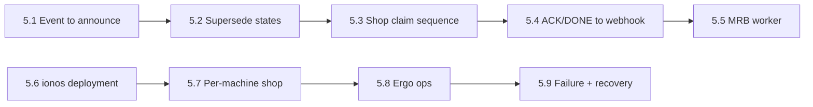
*Caption: the map of the diagrams below. Top row is the job lifecycle; bottom row is where things run and how they recover.*

### 5.1 GitHub event → Jeeves announce
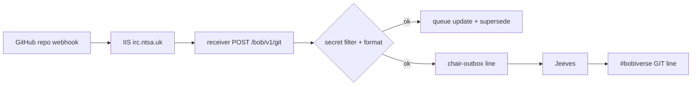
*Caption: one GitHub event becomes one `GIT …` line on #bobiverse and one queue change, with no LLM involved.*

### 5.2 Queue supersede rules
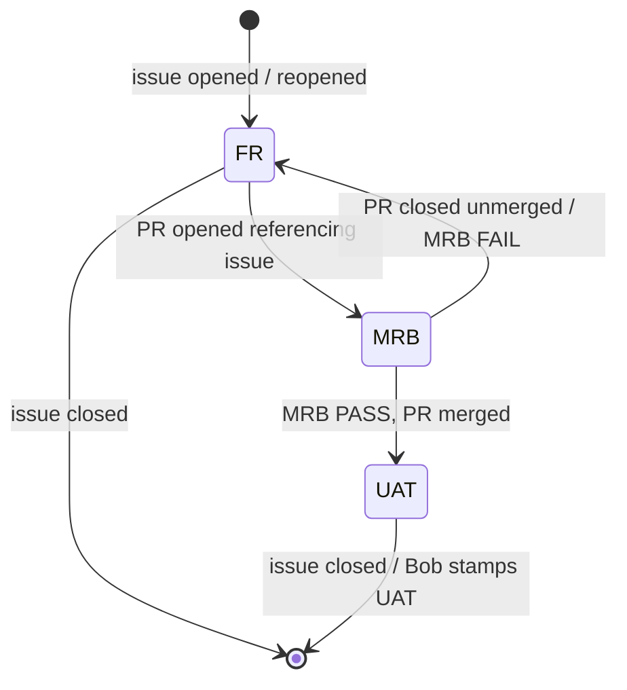
*Caption: the queue holds only the current task per piece of work, and each GitHub event replaces it deterministically.*

### 5.3 Shop claim: !bored → offer → ACK
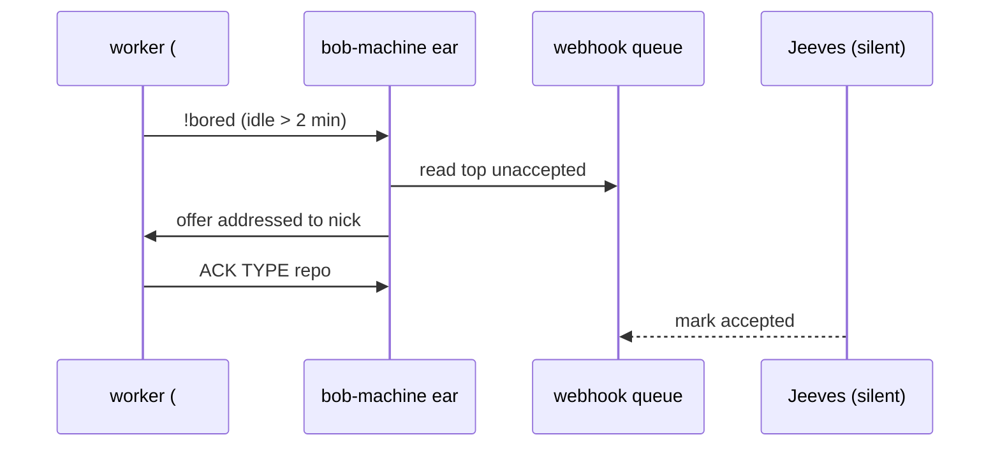
*Caption: the ear offers and the worker ACKs in #machine, while Jeeves only listens and records the acceptance.*

### 5.4 ACK/DONE → webhook busy/idle
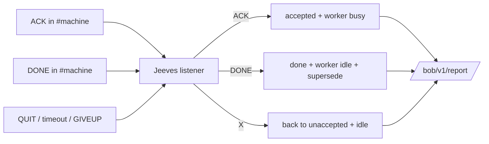
*Caption: Jeeves is the single deterministic writer of worker busy/idle, taken from shop lines.*

### 5.5 MRB worker process
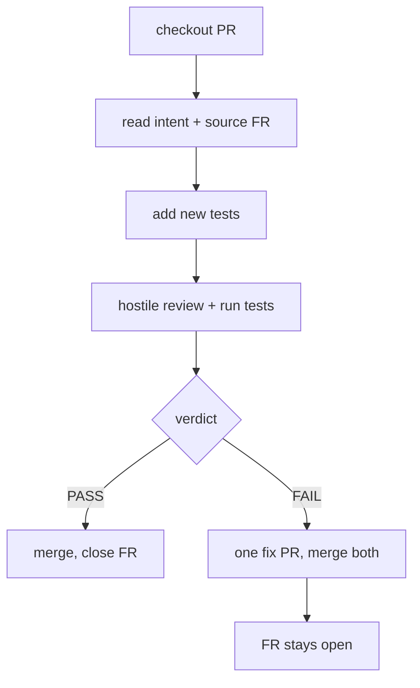
*Caption: the standard MRB transaction; only Bob stamps UAT after a separate UAT worker.*

### 5.6 Deployment on ionos
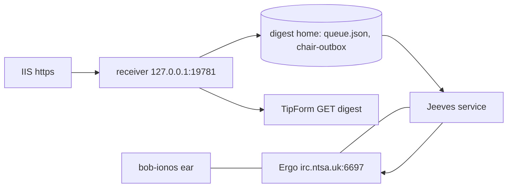
*Caption: what runs on ionos. Ergo, Jeeves, the receiver and the ionos ear share one host but are separate processes.*

### 5.7 Per-machine shop (every fleet machine)
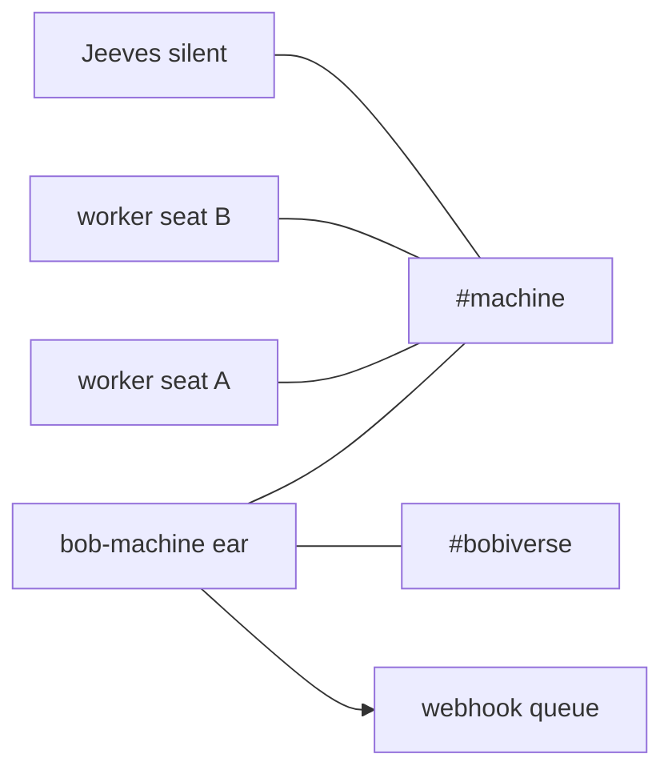
*Caption: each machine's shop holds its ear, its own workers and a silent Jeeves; only the ear also sits in #bobiverse.*

### 5.8 Ergo ops and channel registration
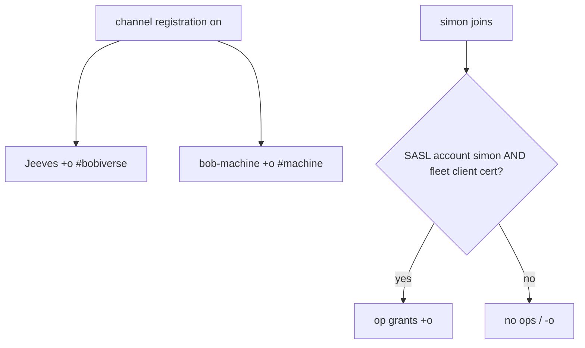
*Caption: durable bot ops come from Ergo registration; simon gets ops only from a fleet machine's own client certificate (agentic_build #327).*

### 5.9 Failure and recovery
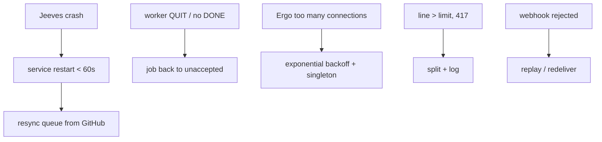
*Caption: every failure has a scripted recovery; none needs a human or an LLM.*

---

## 6. Wire grammar (gh-Jeeves owns and documents it; ears and worker packs must match)
- **Announce** (Jeeves → #bobiverse): `GIT <event> <owner/repo> <action> #<n> <title> by <actor>` (≤380 chars; split per #205).
- **Idle** (worker → own #machine): `!bored`
- **Offer** (ear → #machine), proposed: `<nick>: OFFER <FR|MRB|UAT> <owner/repo>#<n> <url>`. It must be addressed to exactly one nick, and **one open offer or assignment per worker at a time**.
- **Accept** (worker): `ACK <TYPE> <owner/repo>#<n>`
- **Complete** (worker): `DONE <TYPE> <owner/repo>#<n> <PR|PASS merged|FAIL fix#m> <url>`
- **Return** (worker): `NACK|GIVEUP <TYPE> <owner/repo>#<n>`
- **List**: `/msg Jeeves !list` → PM, oldest first: `1/17 FR SimonBarnett/agentic_irc#204 <title> <url>`. Cap 30 lines, then `+K more`; rate limit one per nick per 10 s; `queue empty` when empty. Workers use the PM path only.
- Worker nicks accepted: `{machine}-{pid}` (watch seats, today) and `w-<short>-<pid>` (legacy). Lines are only accepted from a nick in **its own** `#{machine}`. Lines from `bob-*`, `simon` or other channels are ignored.

## 7. Queue model and supersede table (agentic_irc #207 + #211)
| Event | Queue change |
|---|---|
| issue opened **or reopened** | add `FR #n` |
| PR opened referencing `#n` (Closes/Fixes/Resolves/Refs, or linked) | remove `FR #n`, add `MRB` for the PR (store the PR→issue link) |
| PR merged after MRB PASS | remove `MRB`, add `UAT` for the source issue |
| PR closed unmerged | remove `MRB`; restore `FR` if the issue is still open |
| MRB FAIL (fix PR merged with the original) | remove `MRB`; the issue stays open → restore `FR` |
| issue closed | remove any `FR`/`UAT` for it |
| PR edited to change `Closes #n` | re-link and re-apply |
| worker ACK | unaccepted → accepted (nick, machine, ts); worker busy |
| worker DONE | accepted → done; worker idle; apply the matching row above |
| worker QUIT / DONE timeout / GIVEUP | accepted → unaccepted; worker idle |

Other requirements:
- The table is deterministic and idempotent: a replay gives the same queue.
- A **resync** from the GitHub API for watched repos backfills missing open items and drops closed or superseded ones.
- Task kinds shown: **FR / MRB / UAT** (not `PR` for issues).
- Order: oldest first, earliest open issue first within a repo.

## 8. MRB worker process (bob-mrb-worker)
1. Check out the PR branch.
2. Read the intent, the changed files and the source FR.
3. Add **new** tests.
4. Run existing and new tests; do a hostile review.
5. Verdict:
   - **PASS:** merge, then **close the source FR**. Jeeves announces, and a separate UAT worker follows.
   - **FAIL:** **one** fix PR, merge **both**, and the FR **stays open**. No UAT.
   - **The fix PR must not say `Closes #N`** for the FR, because GitHub auto-closes the FR on merge (drain gap 7).
6. Report busy/idle on the webhook (Jeeves derives it from ACK/DONE).
7. Only Bob stamps UAT.

## 9. Webhook contracts
- **GitHub → Bob GIT hook** (reference: `club-madeira-onboarding` hook **685447057**): URL `https://irc.ntsa.uk/bob/v1/git`, events `issues`, `pull_request`, `push`, content type `json`, active, SSL verification on, **no secret configured**. New repos, gh-Jeeves included, copy this.
- **Digest `https://irc.ntsa.uk/bob/v1/report`:**
  - `GET`: public JSON with `machines.<id>` (`nick, online, lastSeen, jobs, running, queued, working_on, workers{pid:{working_on, agent, model}}, pcent`), `cursor_pools[]` and `queue{unaccepted, accepted}` (gh-Jeeves adds `done`).
  - `POST`: shared-secret header (redacted), allow-listed IPs, ops `merge | delete-worker | shop-down | git-claim`. gh-Jeeves adds ops for `ack`, `done`, `release` and `worker-busy/idle`, or folds them into `merge`.
- The `http://bob.ntsa.uk/bob/v1/digest` URL is dead (404). The env override is `AGENTIC_IRC_DIGEST_URL` / `BOB_DIGEST_URL`.
- **Secret filter (#206).** Scan only the fields that are emitted, never the whole payload. Otherwise issues that merely *discuss* secrets are never announced (this happened with agentic_build #327).

## 10. Ergo and ops (agentic_build #327, owner-approved changes only)
- Today: `channels.registration.enabled: false`, `accounts.registration.enabled: false`. Op is lost on reconnect. The cloak is per public IP: bob-flamingo and bob-marchhare share one cloak.
- Target:
  - Operator-only channel registration.
  - Accounts for Jeeves, each bob-{machine} and simon, with SASL for the bots.
  - AMODE +o: Jeeves in `#bobiverse`, bob-{machine} in `#{machine}`.
  - simon gets +o only when logged in **and** presenting a registered per-machine client cert (SASL EXTERNAL, fingerprint → machine registry). Never a standing AMODE for simon.
  - Jeeves must be allowed in every shop.
- **gh-Jeeves never edits Ergo or BobIrcd config.** That stays in agentic_build and needs Simon's approval.

## 11. Worker sessions (watch seat / AgentMonitor / FROM forwarding)
- **Watch seat:** `Watch-AgentHealth.ps1 -WatchWorker -Grok` (AgentMonitor) runs a visible `agent.exe -r <session>` TUI plus a talk-seat `irc_agent` with nick `{machine}-{monitor pid}` (e.g. `marchhare-34992`). `irc_listen.py` writes `FROM …` lines, and the monitor forwards each one.
- **Hidden runs (AgentMonitor #90):** each FROM payload runs as a **separate hidden `agent.exe -r <session> -p <text>`** process. The visible seat therefore **looks idle while it is working**: Simon asked twice to "keep it busy" while it was completing items about every 2 minutes. Busy/idle must come from ACK/DONE on the webhook (Jeeves), not from the TUI.
- **Wake pile-up (AgentMonitor #91):** hidden `-p` runs have no timeout, no reap and no serialisation, so hung wakes pile up. Required: serialise per session, set a max runtime, reap orphans.
- **Reconnect storm:** irc_agent seat liveness (`seat_liveness_loop` → `:recv idle` QUIT when the server has been quiet longer than `seat_recv_idle_s`) makes the monitor relaunch every few seconds. That trips Ergo's **"too many connections" throttle**. Required: exponential backoff with jitter, a singleton per nick, and a recv-idle threshold above the server PING interval (see AgentMonitor #89, agentic_irc #210, agentic_build #328).
- **Stacked assignments:** bob-marchhare sent **multiple ASSIGNs while the worker was still busy**. Required: **one assignment at a time per worker**, gated on the busy state that Jeeves derives from ACK/DONE (agentic_irc #211 and its busy/idle comment). The ear must not offer to a worker that is busy on the webhook.
- **Multi-line assignments** were split into separate wakes, one per line. Assignments must be a **single line** (section 6), or the monitor must coalesce lines per sender within a short window.
- **Nick awareness:** a seat must know its own nick so it acts on ASSIGNs addressed to it (AgentMonitor #87 merged, #88 closed).

## 12. Gaps from today's MarchHare drain dry run (2026-09-25)
| # | Gap | Evidence | Fix owner |
|---|---|---|---|
| 1 | No `!bored` when idle | Seats sat idle; claims came only from hand-delivered wakes. Seat nick `marchhare-34992` does not match `w-mh-<pid>`, so `bored_gate` ignores it anyway. | worker packs / AgentMonitor + ear |
| 2 | Nothing marked accepted | ionos `queue.json`: 28 unaccepted, **0 accepted**, after many ACKs (e.g. skills-visionary #19 ACKed at 10:56 BST) | gh-Jeeves (#211) |
| 3 | Supersede done by hand | FR rows stay after their PR opens (AgentMonitor #88 / PR #87; agentic_irc #204 / PR #203) | gh-Jeeves (#207) |
| 4 | Merged PRs left queued | MRB rows for merged skills-visionary #18/#20/#21, agentic_irc #201/#202, AgentMonitor #87, agentic_build #326 are still unaccepted | gh-Jeeves (#207, resync) |
| 5 | Multi-line assignments split into separate wakes | each ASSIGN line started its own hidden `-p` run | ear grammar + AgentMonitor (#91) |
| 6 | Worker picked unassigned work | no one-at-a-time gate; worker acted on items not addressed to it | ear + worker pack + #211 busy state |
| 7 | "closes #N" closed FRs on a failed MRB | fix or implementer PR bodies with `Closes #N` auto-closed the FR although MRB FAILed (skills-visionary #19 had to be reopened) | MRB skill + gh-Jeeves reopen rule |
| 8 | Hidden runs made the seat look idle; relaunch storm hit Ergo's throttle; multiple ASSIGNs while busy | AgentMonitor #90/#91, parent observation | AgentMonitor, agentic_irc #210/#211, agentic_build #328 |
| 9 | Issues queued as `PR`, reopened not queued | `gitclaim.CLAIM_ACTIONS` | gh-Jeeves (#207) |

## 13. Related open FRs and PRs
**agentic_irc**
- #205 [open FR] split long outbox PRIVMSGs and log Ergo 417 Line too long: https://github.com/SimonBarnett/agentic_irc/issues/205
- #206 [open FR] git webhook secret filter scans the whole payload: https://github.com/SimonBarnett/agentic_irc/issues/206
- #207 [open FR] deterministic GIT task queue: supersede, reopened, accept-on-ack in #machine, resync: https://github.com/SimonBarnett/agentic_irc/issues/207
- #208 [open FR] Jeeves `!list` by PM: https://github.com/SimonBarnett/agentic_irc/issues/208
- #209 [open PR] workers and talk seats JOIN their own #{machine} only: https://github.com/SimonBarnett/agentic_irc/pull/209
- #210 [open PR] watch-seat irc_agent restart crash-loop: https://github.com/SimonBarnett/agentic_irc/pull/210
- #211 [open FR] Jeeves listens in every #{machine}, marks ACK/DONE; comment: webhook busy/idle: https://github.com/SimonBarnett/agentic_irc/issues/211

**agentic_build**
- #327 [open FR] Ergo channel registration, durable ops, simon ops only from a fleet machine: https://github.com/SimonBarnett/agentic_build/issues/327
- #328 [open FR] supervisor for bob-{machine} irc_agent (singleton, graceful restart): https://github.com/SimonBarnett/agentic_build/issues/328
- #329 [open FR] Test-Pack must not join live IRC: https://github.com/SimonBarnett/agentic_build/issues/329
- #330 [open FR] run Jeeves as its own Windows service: https://github.com/SimonBarnett/agentic_build/issues/330

**AgentMonitor**
- #87 [merged PR] addressed IRC wakes tell the seat its own nick: https://github.com/SimonBarnett/AgentMonitor/pull/87
- #88 [closed FR] watch seats must know their own IRC nick: https://github.com/SimonBarnett/AgentMonitor/issues/88
- #89 [open FR] monitor restart must adopt the live agent tree and keep the seat nick: https://github.com/SimonBarnett/AgentMonitor/issues/89
- related: #90 [open FR] hidden `agent -p` resumes make the seat look idle: https://github.com/SimonBarnett/AgentMonitor/issues/90 ; #91 [open FR] hidden wakes never time out or get reaped: https://github.com/SimonBarnett/AgentMonitor/issues/91

## 14. gh-Jeeves scope (what the new repo owns)
1. **Announce chair:** IRC client (TLS, SASL-ready, reconnect with exponential backoff and jitter, singleton nick, 417-safe splitting), joins `#bobiverse` plus every fleet `#{machine}` from the fleet registry, and drains the chair outbox.
2. **Queue engine with supersede:** a pure-function reducer `(queue, event) → queue` for GitHub events and shop events (section 7), with idempotent replay, GitHub resync and FR/MRB/UAT kinds. `queue.json` is the crash mirror; the webhook is the source of truth.
3. **Shop listener:** parses `ACK/DONE/NACK/GIVEUP` from `{machine}-{pid}` / `w-*` nicks in their own shop only. It is silent in shops, returns jobs to unaccepted on QUIT or timeout, and **never handles `!bored` or offers**.
4. **`!list`:** PM replies, capped and rate-limited.
5. **Webhook writer:** POSTs accepted, done and worker busy/idle to `/bob/v1/report`. Jeeves `lastSeen` feeds TipForm (Jeeves up or down).
6. **GitHub receiver** (`/bob/v1/git`): moves in with the queue engine, including the fixed secret filter (#206). The generic digest `/bob/v1/report` fleet fuel merge can stay in agentic_irc behind the same process in phase 1 (see section 16).
7. **Service installer:** Windows service `BobJeeves` (#330):
   - automatic delayed start, recovery restarts, and a single-instance mutex;
   - replaces or disables task `BobJeeves-chair`;
   - runs from the deployed release, not a hotpatch worktree;
   - keeps its state in `~\.agentic-irc-bobiverse`;
   - solves the DPAPI user-scope identity problem (run as a dedicated service account with its own profile, or move the identity to machine-scope protection);
   - rotating logs; never touches Ergo.
8. **Tests:**
   - unit tests for every supersede row, grammar parse and `!list` formatting;
   - integration tests against a **local test ircd** (throwaway Ergo on loopback, or a bundled minimal ircd), **never live IRC**;
   - the **G1 token-less E2E** (section 0).
9. **Docs:** README with the small mermaids above, the wire grammar and ops runbook, and a honesty-box `harvest-agent-skills` skill with `github:` pointing at gh-Jeeves.

Non-goals: LLM features, offering or assigning, Ergo config, TipForm UI, worker implementation.

## 15. What stays where
| Stays in **agentic_irc** | Stays in **agentic_build** |
|---|---|
| Generic `irc_agent.py` (bob ears, talk seats, workers), `seal.py`, `protect.py`, MOOT/FILE/DUMB, `irc_listen.py`, talk-seat liveness, and the **`!bored` → offer → ACK logic in the bob-{machine} ear** (moved from the chair; see agentic_irc #207 §2), plus the digest fuel/pcent merge until it is split out | Ergo install (`Install-BobIrcd.ps1`, #327 registration), `Install-BobFleet.ps1` (calls the gh-Jeeves installer on ionos), TipForm / `Watch-BobTray.ps1`, `Watch-Bobiverse.ps1`, worker packs and MRB skill, `Close-BobSuperseded*`, fleet registry `config/bobiverse.json`, #328 ear supervisor |
| AgentMonitor keeps the watch seat (#89–#91) | skills-visionary keeps Plan (repo creation, webhook, PR setup) |

## 16. Migration plan
1. **Phase 0: freeze and document.**
   - Tag the current chair code in agentic_irc (`jeeves-legacy`).
   - Record ionos drift: Jeeves and the receiver run from `C:\ai\agentic_irc-www@ac4b575`, bob-ionos from a stale branch, and BobIrcd is Stopped while ergo.exe runs.
2. **Phase 1: extract.**
   - Copy `gitclaim.py`, the chair parts of `irc_agent.py`, and the announce/webhook parts of `bobreport.py` / `bobcallback.py` into gh-Jeeves, with history if practical (`git filter-repo`).
   - Keep the wire format byte-compatible. Add the local-ircd test harness and G1.
3. **Phase 2: rule fixes in gh-Jeeves:**
   - remove `!BORED` handling from the chair;
   - add the ACK/DONE listener (#211), the supersede reducer and resync (#207), `!list` (#208), the secret filter (#206), line splitting (#205), and webhook busy/idle.
4. **Phase 3: ear takes the claim.** In agentic_irc, the bob-{machine} ear implements `!bored` → offer (one at a time, skipping busy workers) → reads the ACK. Worker packs send `!bored`, `ACK` and `DONE` in the grammar. Ship this in the **same release window** as phase 2, so there is never a period with no claimer.
5. **Phase 4: service.**
   - gh-Jeeves installs `BobJeeves` (#330), disables `BobJeeves-chair` and deploys from a release tag.
   - `Install-BobFleet.ps1` on ionos calls it.
   - One-off: resync the live queue from GitHub (clearing the 28 stale rows).
6. **Phase 5: cut-over and clean-up.**
   - Remove the chair code from agentic_irc, leaving a thin shim that errors "moved to gh-Jeeves".
   - Update the skills (bob-jeeves-chair, bob-git-accept, bob-token-handoff) and the agentic_build README diagrams 2–4 so they say **Jeeves assigns** (FR #11 / K10).
   - Fix the duplicate `reportUrl` key.
7. **Phase 6: ops.** After Simon approves, agentic_build #327 enables registration and ops.

Rollback: re-enable task `BobJeeves-chair` on the tagged legacy checkout. The queue format stays compatible.

### 16.3 Live smoke test procedure (G2)
1. Pre-check:
   - `GET https://irc.ntsa.uk/bob/v1/report`: Jeeves `lastSeen` is fresh.
   - The ear on the test machine and one worker seat are configured with **no token pools**, and the worker is a scripted fake that replies ACK and DONE.
2. On a sandbox repo with the Bob hook, open issue "smoke <timestamp>". Expect `GIT issues <repo> opened #n` on #bobiverse (ionos `~\.agentic-irc-bobiverse\irc.log`) and `FR #n` in `queue.unaccepted`.
3. The worker sends `!bored` in `#{machine}`. Expect the ear's `OFFER FR <repo>#n` addressed to that nick.
4. The worker sends `ACK FR <repo>#n`. Expect the row in `queue.accepted` and the worker busy in `machines.<id>.workers`.
5. Open a PR with `Closes #n`. Expect `FR #n` to be replaced by `MRB #pr`.
6. The worker sends `DONE FR <repo>#n PR <url>`. Expect the worker idle and the row done.
7. Close the PR unmerged. Expect `FR #n` restored. Close the issue. Expect it removed.
8. Record the timings and the log excerpts in the gh-Jeeves release notes.

## 17. Secrets and redaction
- Never commit, print or put in issue bodies: the Ergo connect secret, the report shared secret, SASL credentials, client-cert private keys or API keys. Refer to them by role only.
- The receiver's filter rejects payloads containing certain marker strings (literal file names and `key=` forms). Issue and PR text for gh-Jeeves must avoid them until #206 is fixed, or Jeeves will not announce.
- Fleet GIT hooks carry no secret. The `/bob/v1/report` writes use a shared-secret header whose value is stored outside git on each box.

## 18. Not confirmed from sources (open questions for the visionary)
- **Who emits `ASSIGN`:** no `ASSIGN` emitter was found in agentic_irc or agentic_build code. It looks hand- or LLM-sent through the bob-marchhare outbox. The deterministic offer grammar in section 6 is therefore a proposal.
- **How IIS proxies to `127.0.0.1:19781`:** the rewrite rule was not inspected.
- **Why BobIrcd shows Stopped while ergo.exe runs:** not investigated (and Ergo config must not be touched).
- **Exact Ergo throttle values** ("too many connections") and the default `seat_recv_idle_s`: not read from `ircd.yaml` or `talk_seat_ghost.py`.
- **The `BobReport-ionos` launcher script** is ad hoc and not in any repo. gh-Jeeves (or agentic_build) should own it.
- **The full drain-report document for today's dry run** was not located on disk. The gaps in section 12 come from the task brief plus live evidence (queue.json, FRs).
