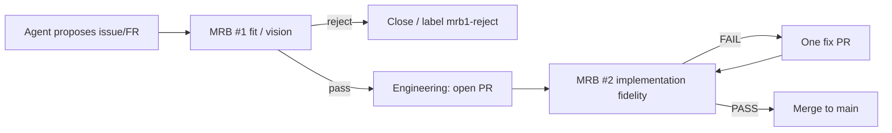

# FR #151: two MRB gates for agent-submitted work

Agents may propose issues and feature requests. **Nothing becomes engineering
work until it passes MRB #1.** Implementation PRs still pass **MRB #2** before
merge (FR #92).



## MRB #1 — fit check (vision)

**Question:** Does this proposal make sense and fit the project vision
(`docs/vision.md`, `docs/brief/JEEVES_BRIEF.md`, README CAST IRON)?

| | |
|---|---|
| When | After an agent (or intake) opens an issue/FR |
| Who | **Simon** (human). Bob may advise on product shape; seats do **not** stamp fit. |
| Pass | Label `mrb1-pass` (remove `needs-mrb1`); issue may be assigned / queued for FR work |
| Fail | Label `mrb1-reject`; close or leave parked; **no PR** for that proposal |
| Not about | Test coverage, code style, or whether a future PR matches the text |

Intake (`via-intake`) issues get `needs-mrb1` automatically (FR #151). Humans
apply `mrb1-pass` or `mrb1-reject` after review.

### Labels (must exist on the repo)

GitHub rejects issue create with unknown labels (HTTP 422). Create once:

```text
python tools/ensure_mrb1_labels.py --repo SimonBarnett/gh-Jeeves
```

| Label | Color | Meaning |
|-------|-------|---------|
| `needs-mrb1` | FBCA04 | Awaiting fit check |
| `mrb1-pass` | 0E8A16 | Fit approved — engineering allowed |
| `mrb1-reject` | B60205 | Fit rejected — no PR |

## MRB #2 — implementation check (fidelity)

**Question:** Did the PR implement what the **approved** issue asked for?

| | |
|---|---|
| When | After an FR worker opens a PR |
| Who | **Other seat** posts `mrb/verdict` (FR #92). Self-MRB only on the documented one-seat path. |
| Pass | Hostile review + full `pytest tests/` + duration gate → merge |
| Fail | Exactly one fix PR; another seat MRBs the fix |
| Not about | Re-litigating whether the idea was good (that was MRB #1) |

Details: `docs/mrb-enforcement.md`, skill `jeeves-task-modes`.

## Why two gates

- Agents propose freely; humans keep vision noise out of the engineering queue.
- Reviewers do not pay twice for the same judgment: fit once, fidelity once.

## Related

- FR #151 (this doc), FR #92 (`mrb/verdict`), FR #26 (intake)
- Skills: `jeeves-mrb-gates`, `jeeves-task-modes`
