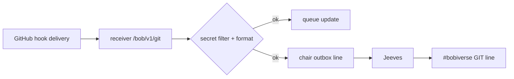

# jeeves-announce-debug

Seed FR: #20. Related: length-safe lines #24, agentic_irc #205/#206.

Agentic control is an overlay: the token-less path must never depend on this skill.

## Trace the path

*Caption: find the first hop where the event disappears.*

1. **Hook delivery:** repo Settings → Webhooks → Recent deliveries. The hook
   posts `issues`, `pull_request`, `push` as JSON to `https://{bob-host}/bob/v1/git`.
   Redeliver if it failed.
2. **Receiver / secret filter:** the filter must scan only the emitted fields,
   not the whole payload; otherwise issues that merely *discuss* secrets are
   dropped (#206).
3. **Queue:** the item should be in the webhook queue even if IRC failed — the
   queue never depends on IRC text.
4. **Chair outbox piling up:** Jeeves not connected or not draining — run
   `jeeves-health`.
5. **Too long (417):** vital fields first (event, type, `owner/repo#n`, action,
   URL), title last and the only part truncated; byte budget, UTF-8 safe; never
   a continuation line a parser needs (#24).

Jeeves announces **only** on `#bobiverse` — a missing GIT line in a shop is expected.

Related: `jeeves-health`, `jeeves-queue`.
