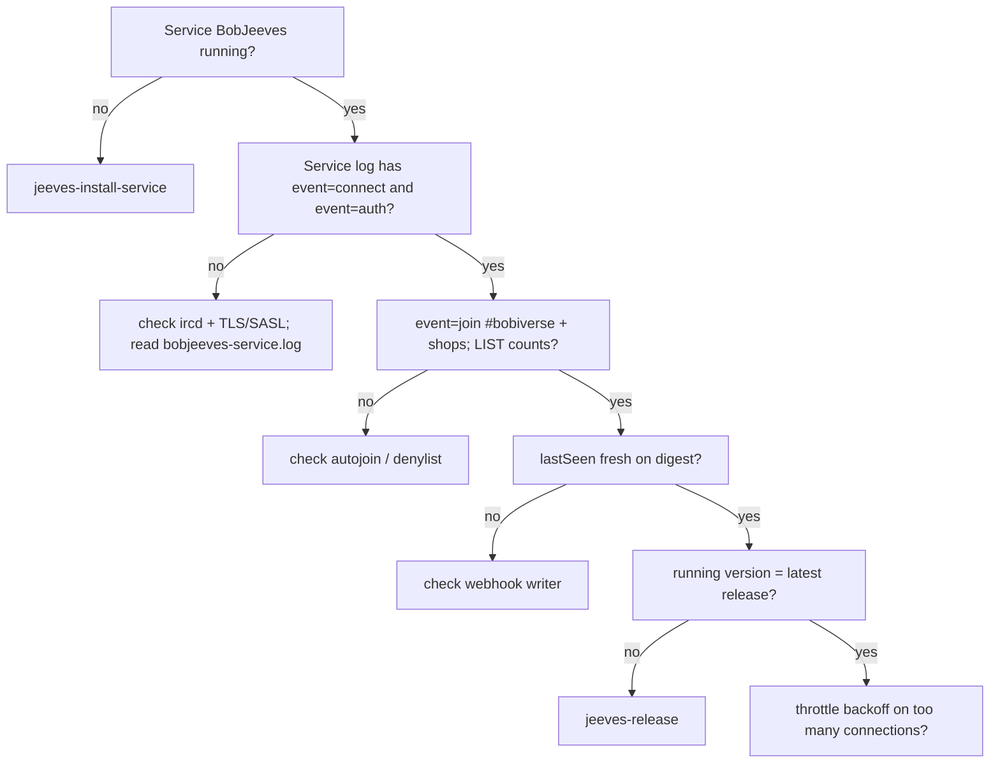

# jeeves-health

Seed FR: #18.

## Overlay

**Agentic control is an overlay.** The token-less path (brief section 0 / issue #1)
must **never** depend on this skill or an LLM. Scripts own G1; this skill helps
operators diagnose. Report-only — **never** start/stop Ergo or BobIrcd.

## Checks



*Caption: work top-down; the first failing check tells you which skill to run next.*

1. **Service:** `BobJeeves` is Running (single instance). A legacy chair
   scheduled task must not also be running.
2. **Service log (FR #73):** `%JEEVES_HOME%\bobjeeves-service.log` (rotating).
   Look for structured `event=` INFO lines — no IRC probe nick required:
   - `event=connect host=… port=… tls=… nick=…`
   - `event=auth method=sasl|pass|none result=…` (never secrets)
   - `event=join channel=#…` / `event=part channel=#…`
   - `event=list channels=N run=N`
   - `event=announce` / `event=ack` / `event=done`
   - `event=resync` phase start/end with counts
3. **Presence:** nick `Jeeves` is in `#bobiverse` (op) and silently in every
   `#{machine}` (confirm via log joins + IRC if needed).
4. **Digest lastSeen:** `GET https://irc.ntsa.uk/bob/v1/report` — Jeeves /
   machine `lastSeen` is fresh.
5. **Version drift:** running version equals the latest gh-Jeeves release tag
   (`jeeves-release` / `JEEVES_RELEASE_TAG`).
6. **Throttle / backoff:** on "too many connections", Jeeves reconnects in place
   with exponential backoff (cap ~30s, K13 / FR #14) — kill duplicates, do not
   reconnect-loop.

## Commands

CI-safe **dry-run** first (no sockets, no service mutation):

```powershell
python -m jeeves.health --dry-run --json
python -m jeeves health --dry-run --json
```

Live report-only probe (IRC TCP/TLS + optional `sc query`; still never mutates):

```powershell
python -m jeeves.health --json --host irc.ntsa.uk --port 6697
python -m jeeves health --json
```

Exit codes: `0` ok, `1` degraded (live), `2` dry-run skill incomplete.

## Ops expectations

- Jeeves is op in `#bobiverse`; each bob-{machine} is op in its own `#{machine}`.
- If the ircd itself is down, **report it**; gh-Jeeves never touches Ergo/BobIrcd
  (raise agentic_build #327).
- Related: `jeeves-install-service`, `jeeves-announce-debug`, `jeeves-release`.

## Tests

```text
pytest -q tests/test_skill_health_fr18.py tests/cast_iron/test_k7_health_irc_down.py
```
