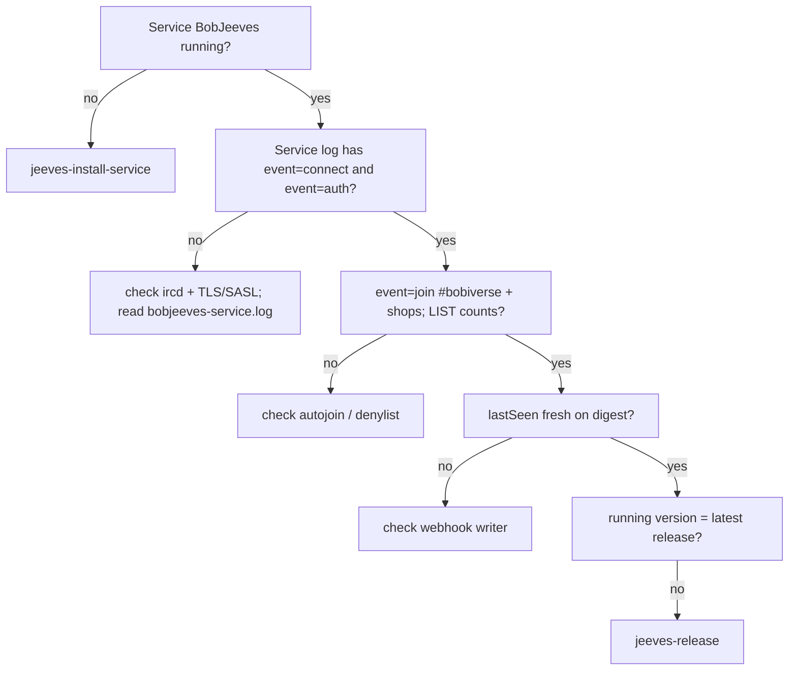

# jeeves-health

Seed FR: #18.

Agentic control is an overlay: the token-less path must never depend on this skill.

## Checks

*Caption: work top-down; the first failing check tells you which skill to run next.*

1. **Service:** `BobJeeves` is Running (single instance). A legacy chair
   scheduled task must not also be running.
2. **Service log (FR #73):** `%JEEVES_HOME%\bobjeeves-service.log` (rotating).
   Look for structured `event=` INFO lines — no IRC probe nick required:
   - `event=connect host=… port=… tls=… nick=…`
   - `event=auth method=sasl|pass|none result=…` (never secrets)
   - `event=join channel=#…` / `event=part channel=#…`
   - `event=list channels=N run=N`
   - `event=announce repo=owner/name#n mode=FR|MRB|…`
   - `event=ack` / `event=done` nick + job
   - `event=cmd name=list|help|…`
   - `event=resync phase=start|end … counts`
3. **Presence:** nick `Jeeves` is in `#bobiverse` (op) and silently in every
   `#{machine}` listed in the fleet registry (confirm via log joins + IRC if needed).
4. **Digest:** `GET https://{bob-host}/bob/v1/report` — Jeeves `lastSeen` is fresh.
5. **Version drift:** the version Jeeves reports equals the latest gh-Jeeves release tag.
6. **Throttle:** on "too many connections", Jeeves must back off exponentially
   and stay singleton — kill duplicates, don't reconnect-loop.
6. **Service log (FR #73):** read `%JEEVES_HOME%\bobjeeves-service.log` (rotating).
   Prefer these structured lines over an outside IRC probe nick:
   - `event=connect host=… port=… tls=… nick=…`
   - `event=auth method=sasl|pass|none result=…` (never secrets)
   - `event=join channel=#…` / `event=part channel=#…`
   - `event=list channels=N run=N`
   - `event=announce repo=owner/name#n mode=…`
   - `event=ack` / `event=done nick=… job=…`
   - `event=cmd name=list|help|…`
   - `event=resync_start` / `event=resync_end` with counts
   Missing `event=connect` after service start ⇒ IRC path never came up.

## Ops expectations

- Jeeves is op in `#bobiverse`; each bob-{machine} is op in its own `#{machine}`.
  Durable ops need ircd channel registration (owned outside this repo).
- Owner ops only from a fleet machine's own client certificate — masked hosts
  are shared per public IP, so never identify a machine by host.
- A bob-{machine} may kick invalid workers from its own shop only; never
  Jeeves or another bob.
- If the ircd itself is down, **report it**; gh-Jeeves never touches Ergo/BobIrcd.

Related: `jeeves-install-service`, `jeeves-announce-debug`, `jeeves-release`.
