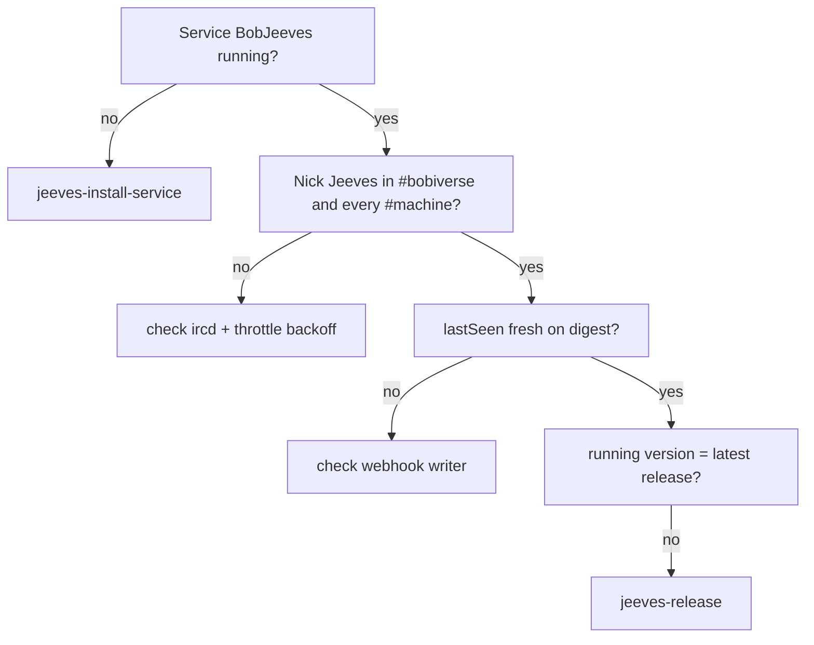

# jeeves-health

Seed FR: #18.

Agentic control is an overlay: the token-less path must never depend on this skill.

## Checks

*Caption: work top-down; the first failing check tells you which skill to run next.*

1. **Service:** `BobJeeves` is Running (single instance). A legacy chair
   scheduled task must not also be running.
2. **Presence:** nick `Jeeves` is in `#bobiverse` (op) and silently in every
   `#{machine}` listed in the fleet registry.
3. **Digest:** `GET https://{bob-host}/bob/v1/report` — Jeeves `lastSeen` is fresh.
4. **Version drift:** the version Jeeves reports equals the latest gh-Jeeves release tag.
5. **Throttle:** on "too many connections", Jeeves must back off exponentially
   and stay singleton — kill duplicates, don't reconnect-loop.

## Ops expectations

- Jeeves is op in `#bobiverse`; each bob-{machine} is op in its own `#{machine}`.
  Durable ops need ircd channel registration (owned outside this repo).
- Owner ops only from a fleet machine's own client certificate — masked hosts
  are shared per public IP, so never identify a machine by host.
- A bob-{machine} may kick invalid workers from its own shop only; never
  Jeeves or another bob.
- If the ircd itself is down, **report it**; gh-Jeeves never touches Ergo/BobIrcd.

Related: `jeeves-install-service`, `jeeves-announce-debug`, `jeeves-release`.
