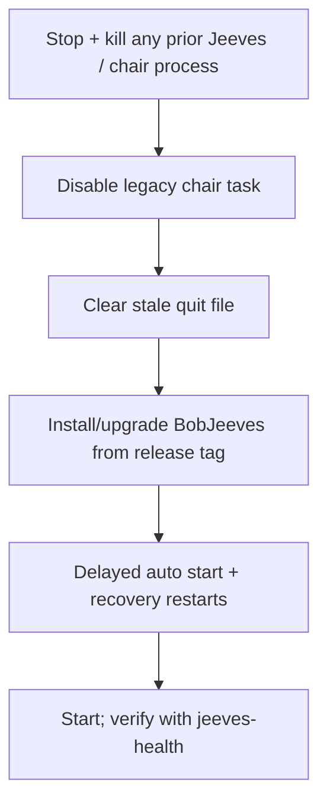

# jeeves-install-service

Seed FR: #17 (service: agentic_build #330).

Agentic control is an overlay: the token-less path must never depend on this skill.

## Steps (idempotent)

*Caption: one singleton Jeeves, run by the service from a tagged release.*

1. Stop the service and kill any prior Jeeves / `--chair` process (singleton).
2. Disable the legacy chair scheduled task if present (keep it for rollback).
3. Clear any stale quit file in the chair home before starting.
4. Install or upgrade `BobJeeves` from the deployed release, never a hotpatch
   worktree: automatic (delayed) start, recovery restarts, single-instance
   mutex, rotating logs.
5. Keep identity home and digest home separate (do not merge them). Registry:
   `chairNick = Jeeves`, `chairHome = {chair-host}`.
6. Start and run `jeeves-health`.

## Identity gotcha

If the sealed IRC identity only decrypts as the owning user (user-scope
protection), a LocalSystem service crash-loops. Fix by running the service as a
dedicated service account with its own profile, or move the identity to
machine-scope protection. Never paste the identity secret anywhere.

## Never

- Touch Ergo / BobIrcd config or services — report issues instead.
- Commit or log connect passwords, report secrets or keys.

Related: `jeeves-health`, `jeeves-release`.
