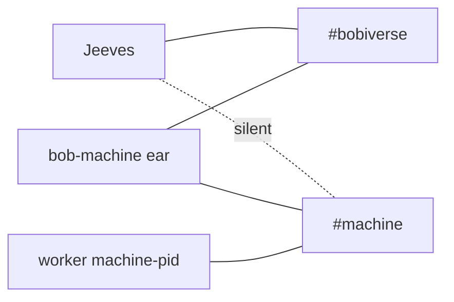

---
name: jeeves-irc-roles
description: >
  Use this when connecting an agent, worker or bob to the fleet IRC and you
  need to know which nick and channels it may use, how to keep the connect
  secret out of git, or how to listen without spending AI tokens. Also
  /jeeves-irc-roles.
---

# jeeves-irc-roles

Channel and nick rules that Jeeves relies on. Connection is TLS to
`{irc-host}:6697`.

Agentic control is an overlay: the token-less path must never depend on this skill.

## Roles

| Role | Nick | Channels |
|------|------|----------|
| Chair | `Jeeves` | `#bobiverse` (op) + every `#{machine}` (silent) |
| Machine ear | `bob-{machine}` | own `#{machine}` (op) + `#bobiverse` |
| Worker seat | `{machine}-<pid>` | own `#{machine}` **only** ÔÇö never `#bobiverse` |
| Named agent | its own name | as configured; its own state home |

*Caption: only Jeeves and the ears sit in #bobiverse; workers live in their own shop.*

## Rules

- One state home per nick; never share a bob's home with an agent.
- The connect password comes from an env var or a local secret file outside
  git ÔÇö never commit, print or paste it.
- Join channels via the client's channel list on (re)connect, not via queued
  raw JOIN lines.
- Listen with a script that writes incoming lines to a log, so no agent tokens
  are spent polling. Never poll `#bobiverse` from an agent chat.
- Jeeves only trusts `{machine}-<pid>` lines in their own `#{machine}`; a
  worker in the wrong channel is invisible to the queue.

Related: `jeeves-shop-protocol`, `jeeves-health`.
