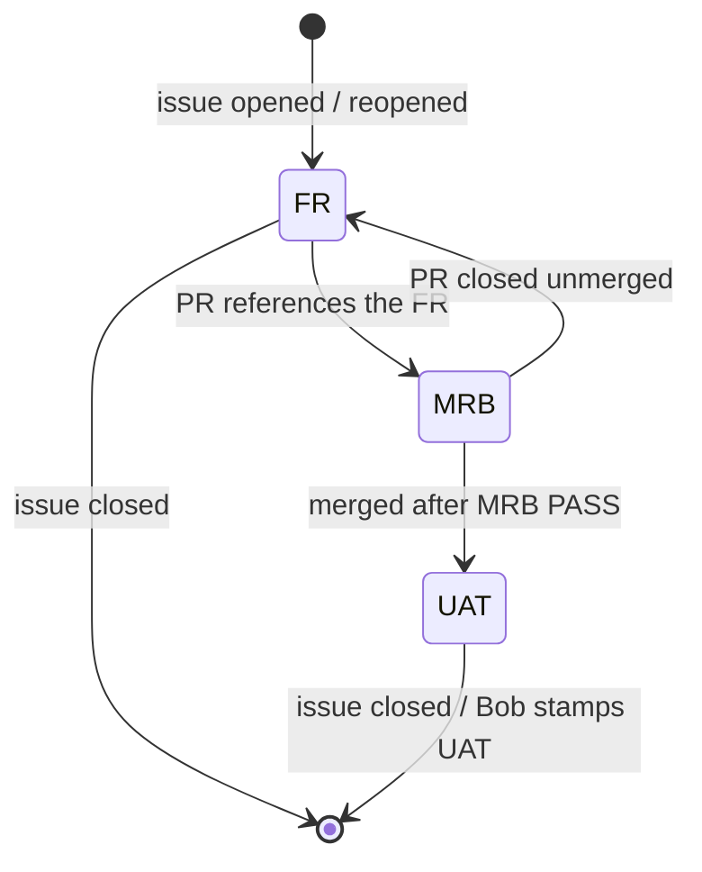

# jeeves-queue

Seed FR: #19. Related: resync #25, `!help` #27, length-safe lines #24.

Agentic control is an overlay: the token-less path must never depend on this skill.

## Source of truth

The digest webhook `https://{bob-host}/bob/v1/report` owns the queue
(`queue.unaccepted`, `queue.accepted`, `queue.done`). The local `queue.json` is
a crash mirror only. Jeeves announces GIT work **only** on `#bobiverse` and
writes the queue to the webhook; it never offers jobs.

## Supersede rules

*Caption: the queue holds only the current task per piece of work; each GitHub event replaces it deterministically.*

- A PR that references an FR (Closes/Fixes/Resolves/Refs or linked) turns it into an **MRB**.
- A merge after MRB PASS turns it into a **UAT**. Only Bob stamps UAT.
- A PR closed unmerged restores the **FR** (if the issue is still open).
- MRB FAIL (fix PR merged with the original) → issue stays open → FR restored.
- A closed issue removes the task; a reopened issue re-adds the **FR**.
- Worker ACK → accepted; DONE → done, then the matching row above.
- Deterministic and idempotent: replaying events gives the same queue.
  Order: oldest first. Kinds shown: FR / MRB / UAT (never `PR`).

## Resync (#25)

- On start, Jeeves rebuilds the queue from GitHub (open issues → FR, open PRs
  → MRB, merged-unstamped → UAT), keeps accepted items whose worker is still in
  its `#{machine}`, and returns orphaned accepted items to unaccepted.
- Then it resyncs **quietly every 15 minutes**. If GitHub is down it starts
  from `queue.json` and retries — never from an empty queue.
- On demand: `!resync` (bobs and owner only).

## Commands

- `!list [all|<repo>]` → reply **by PM only**, one line per job
  (`1/17 FR owner/repo#n <title> <url>`), capped (30 lines then `+K more`),
  paced under the ircd flood limit, rate-limited per nick. `queue empty` when empty.
- `!help [cmd]` → PM, generated from the command registry (#27), so it cannot
  drift from what Jeeves does. Workers never see restricted commands.

## Manual repair (last resort)

1. Prefer `!resync`. Only edit by hand if resync cannot fix it.
2. Dry-run: print the diff (added / removed / retyped / kept) first.
3. Apply through the webhook writer, not by editing `queue.json`.
4. Record what you did in an issue on this repo.

Related: `jeeves-shop-protocol`, `jeeves-worker-state`, `jeeves-announce-debug`.
