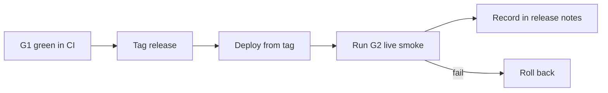

# jeeves-release

Seed FR: #22. Steps from `docs/migration-plan.md` and the brief.

## Overlay

**Agentic control is an overlay.** The token-less path (brief section 0 / issue #1)
must **never** depend on this skill or an LLM. Scripts own G1; operators own
`-Apply`. **Never** touch Ergo / BobIrcd / `ircd.yaml`. FR workers never
`-Apply` on production.



*Caption: a release is shippable only with G1 green and G2 recorded.*

1. G1 green on the release commit (`jeeves-token-less-gate`).
2. Tag the release (`JEEVES_RELEASE_TAG` / git tag). Deploy from the tag with
   `tools/Deploy-BobJeevesRelease.ps1` (or `jeeves-install-service` from that
   tag) — never a hotpatch worktree.
3. Jeeves reports its running version to the webhook; `jeeves-health` checks
   **drift** against the release tag.
4. Run G2 and record timings and log excerpts in the release notes.
5. **Rollback:** reinstall the previous tag via `Deploy-BobJeevesRelease.ps1`,
   or re-enable the legacy chair task on the tagged legacy checkout. The queue
   format stays compatible.

## Commands

CI-safe **dry-run** first (default for the deploy script; never mutates):

```powershell
python -m jeeves.release_tool --dry-run --json
python -m jeeves release --dry-run --json

powershell -NoProfile -ExecutionPolicy Bypass -File tools\Deploy-BobJeevesRelease.ps1 -DryRun -Json
```

Operator apply (elevated, ionos only — not FR workers):

```powershell
powershell -File tools\Deploy-BobJeevesRelease.ps1 -Apply -Tag vX.Y.Z -Json
```

Env: `JEEVES_RELEASE_TAG` / `JEEVES_EXPECTED_TAG` for drift. Exit codes: `0` ok, `2` plan/skill errors.

## Tests

```text
pytest -q tests/test_skill_release_fr22.py tests/test_version_drift_fr6.py
```

Related: `jeeves-install-service`, `jeeves-health`, `jeeves-token-less-gate`.
