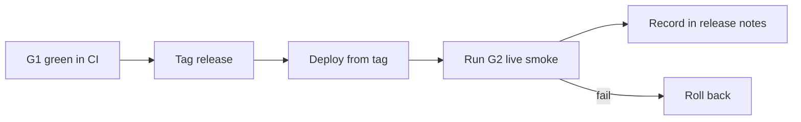

# jeeves-release

Seed FR: #22. No local playbook was harvested for this yet; steps below are
from `docs/migration-plan.md` and the brief.

Agentic control is an overlay: the token-less path must never depend on this skill.

*Caption: a release is shippable only with G1 green and G2 recorded.*

1. G1 green on the release commit (`jeeves-token-less-gate`).
2. Tag the release; deploy from the tag via `jeeves-install-service` (never a hotpatch worktree).
3. Jeeves reports its running version to the webhook; `jeeves-health` checks drift.
4. Run G2 and record timings and log excerpts in the release notes.
5. **Rollback:** reinstall the previous tag, or re-enable the legacy chair task
   on the tagged legacy checkout. The queue format stays compatible.
