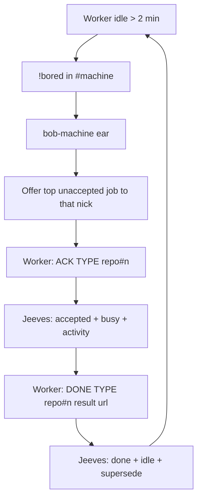

# jeeves-shop-protocol

Wire contract for claims in each `#{machine}` shop. Jeeves owns the grammar and
the ACK/DONE recording; the ear's `!bored` → offer code lives in agentic_irc.

Agentic control is an overlay: the token-less path must never depend on this skill.

## Who does what (CAST IRON)

| Actor | Channels | Does | Never |
|-------|----------|------|-------|
| Jeeves | `#bobiverse` + every `#{machine}` | Announces GIT work on `#bobiverse` only; keeps the queue on the digest webhook; listens silently in shops for ACK/DONE | Replies in shops, handles `!bored`, makes offers |
| bob-{machine} ear | its own `#{machine}` (+ `#bobiverse`) | Answers `!bored` with the top unaccepted job addressed to that nick; takes the ACK | Offers to a busy worker; stacks offers |
| Worker `{machine}-<pid>` | its own `#{machine}` only | `!bored` after >2 min idle; `ACK`; does the task; `DONE` | Joins `#bobiverse` |

Work reaches workers **only** as channel messages from the ear in `#{machine}`.
No wake files, no console injection, no PMs.

## Flow

*Caption: the ear offers, the worker ACKs and DONEs in its own shop, and Jeeves silently turns those lines into webhook state.*

## Grammar

- Idle (worker → own shop): `!bored`
- Offer (ear): `<nick>: OFFER <FR|MRB|UAT> <owner/repo>#<n> <url>` — one open offer per worker.
- Accept: `ACK <TYPE> <owner/repo>#<n>`
- Complete: `DONE <TYPE> <owner/repo>#<n> <PR|PASS merged|FAIL fix#m> <url>`
- Return: `NACK|GIVEUP <TYPE> <owner/repo>#<n>` → back to unaccepted, worker idle.

## What Jeeves records

Jeeves trusts only `{machine}-<pid>` nicks, and only in **their own**
`#{machine}`. Lines from `bob-*`, humans or other channels are ignored.

- **ACK** → fire the digest webhook: job **accepted**, worker **busy**, activity
  `<MODE> <repo>#<n> <title>` (shown on the TipForm START tile).
- **DONE** → job **completed**, activity cleared, worker **idle**, apply the
  supersede rules (see `jeeves-queue`).
- Worker QUIT / DONE timeout / GIVEUP → job back to unaccepted, worker idle.

## Checks

1. Worker nick matches `{machine}-<pid>` and it sits only in `#{machine}`.
2. After an ACK, the job is in `queue.accepted` and the worker shows busy with
   the activity text on `GET https://{bob-host}/bob/v1/report`.
3. After DONE, the worker is idle with no jobs and the queue is superseded.
4. Jeeves said nothing in the shop.

Related: `jeeves-worker-state`, `jeeves-queue`, `jeeves-irc-roles`; wire
grammar in `docs/functional-spec.md`; gate #1.
