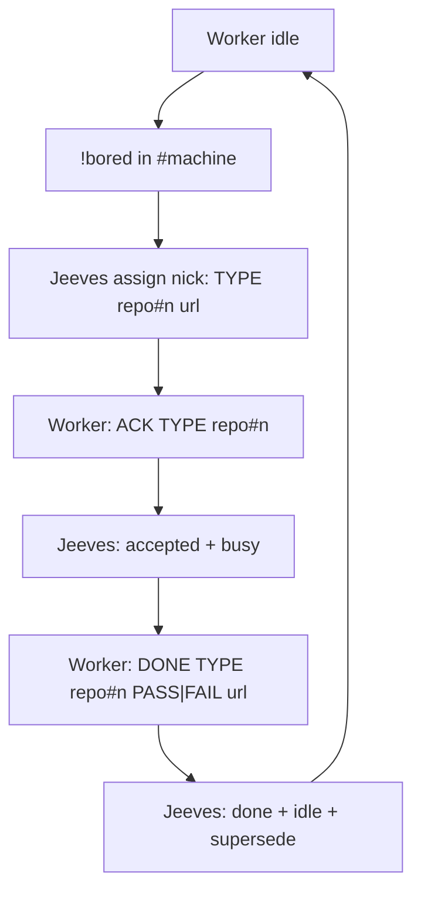

# jeeves-shop-protocol

Wire contract for claims in each `#{machine}` shop. **Jeeves owns**
`!bored` → assign (FR #106; ear `OFFER` retired) and ACK/DONE recording.

Agentic control is an overlay: the token-less path must never depend on this skill.

## Who does what (CAST IRON)

| Actor | Channels | Does | Never |
|-------|----------|------|-------|
| Jeeves | `#bobiverse` + every `#{machine}` | Announces GIT on `#bobiverse`; queue on digest webhook; on trusted `!bored` **assigns** one line; records ACK/DONE | Emit ear-style `OFFER`; LLM on token-less path |
| bob-{machine} ear | its own `#{machine}` (+ `#bobiverse`) | Peer/digest ear duties | Claim/OFFER jobs (retired) |
| Worker `{machine}-<pid>` | its own `#{machine}` only | `!bored` (monitor-owned for watch seats); `ACK`; work; `DONE` | Post `!bored` from the model; join `#bobiverse` (fleet workers) |

Work reaches workers as the Jeeves assign line in `#{machine}` after `!bored`.

## Flow

*Caption: Jeeves assigns on !bored; the worker ACKs and DONEs; ear OFFER is retired.*

## Grammar

- Idle (worker/monitor → own shop): `!bored`
- Assign (Jeeves, FR #106): `<nick>: <FR|MRB|UAT> <owner/repo>#<n> <url>` — one open assign per worker
- Accept: `ACK <TYPE> <owner/repo>#<n>` (outbox line starts with `ACK`)
- Complete: `DONE <TYPE> <owner/repo>#<n> [PASS|FAIL] <url>` (nothing after URL; model never posts `!bored`)
- Return: `NACK|GIVEUP <TYPE> <owner/repo>#<n>` → back to unaccepted, worker idle

## What Jeeves records

Jeeves trusts only `{machine}-{pid}` nicks, and only in **their own**
`#{machine}`. Lines from `bob-*`, humans or other channels are ignored for claim.

- **`!bored`** → assign next unaccepted (focus sort); one open offer/assign per seat
- **ACK** → digest webhook: job **accepted**, worker **busy**
- **DONE** → job **completed**, worker **idle**, supersede (`jeeves-queue`)
- Worker QUIT / timeout / GIVEUP → job back to unaccepted, worker idle

## Checks

1. Worker nick matches `{machine}-{pid}` and it sits only in `#{machine}`.
2. After `!bored`, shop shows `<nick>: <TYPE> <repo>#n <url>` from Jeeves (not `OFFER`).
3. After ACK, job is in `queue.accepted` and worker busy on `GET …/bob/v1/report`.
4. After DONE, worker idle and queue superseded.

Related: `jeeves-worker-state`, `jeeves-queue`, `jeeves-irc-roles`; wire in
`docs/functional-spec.md` and README (SoT).
