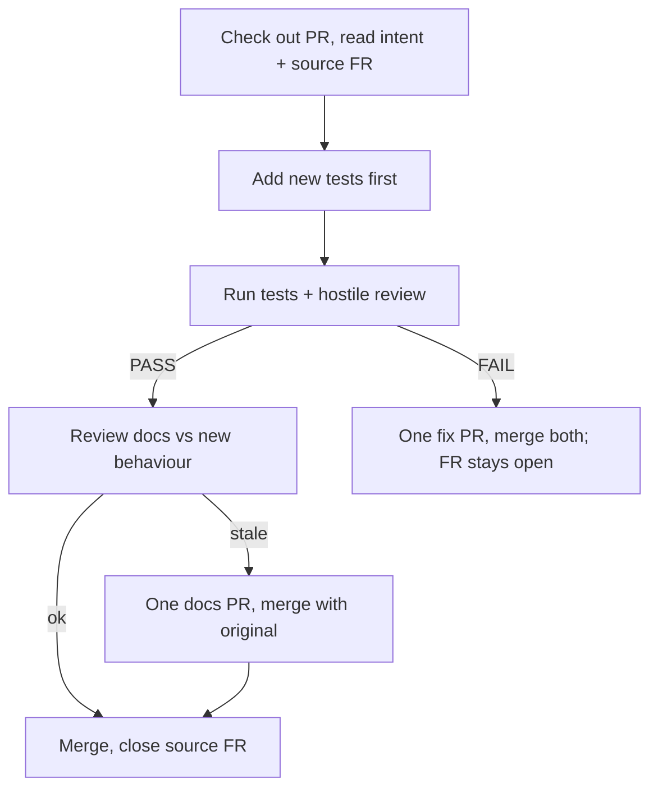

# jeeves-task-modes

What a worker does between `ACK` and `DONE`, and how Jeeves' queue reacts.
Refs gate #1 and supersede in `jeeves-queue`.

Agentic control is an overlay: the token-less path must never depend on this skill.

## Three modes only

| Mode | Work | Ends with |
|------|------|-----------|
| **FR** | Earliest open issue/FR → open a PR that references it | `DONE FR <repo>#n PR <url>` — Jeeves turns the FR into an MRB |
| **MRB** | Hostile review of a PR | `DONE MRB <repo>#n PASS merged <url>` or `FAIL fix#m` |
| **UAT** | After MRB PASS, a **separate** worker | Only Bob stamps UAT |

Prefer a different worker for MRB than the PR author when 2+ are free; with one
free seat it may continue into MRB.

## MRB

*Caption: tests first, then hostile review; PASS may add one docs PR, FAIL adds exactly one fix PR.*

- **PASS:** review README, `skills/`, `docs/`, diagrams and help text; if
  anything is stale, open **one** docs PR and merge it with the original. Close
  the source FR. The merge after PASS makes the queue item a **UAT**.
- **FAIL:** open **one** fix PR and merge both. The source FR stays open, so
  the queue restores the **FR**. The fix PR must not say `Closes #n` for the FR.
- Never stamp UAT from an MRB worker.

## Worker hygiene

- Work arrives only as the ear's offer in your own `#{machine}`; ACK it before starting.
- Send `DONE` (or `GIVEUP`) when finished; then after >2 min idle send `!bored`.

Related: `jeeves-shop-protocol`, `jeeves-queue`.
