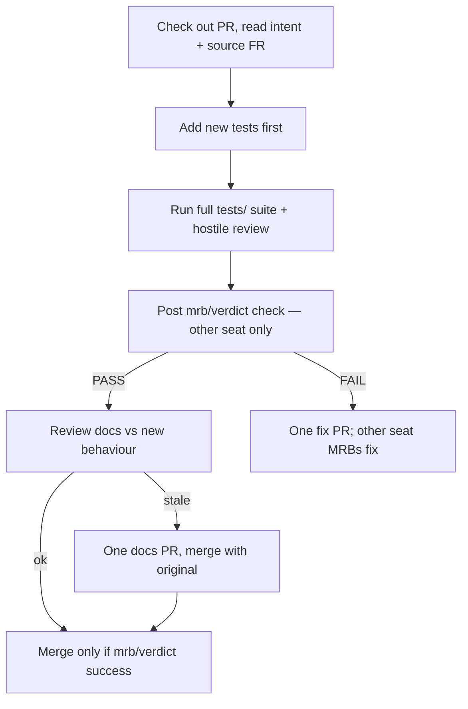

# jeeves-task-modes

What a worker does between `ACK` and `DONE`, and how Jeeves' queue reacts.
Refs gate #1 and supersede in `jeeves-queue`.

Agentic control is an overlay: the token-less path must never depend on this skill.

## Three modes only

| Mode | Work | Ends with |
|------|------|-----------|
| **FR** | Earliest open issue/FR → open a PR that references it | `DONE FR <repo>#n PR <url>` — Jeeves turns the FR into an MRB |
| **MRB** | Hostile review of a PR | `DONE MRB <repo>#n PASS merged <url>` or `FAIL fix#m` |
| **UAT** | After MRB PASS, a **separate** worker | Only Bob stamps UAT |

Prefer a different worker for MRB than the PR author when 2+ are free; with one
free seat it may continue into MRB.

Do **not** open an FR implementation PR for an issue still labeled `needs-mrb1`
or `mrb1-reject` (FR #151 MRB #1 fit gate — see `jeeves-mrb-gates`).

## MRB



*Caption: tests first, then hostile review; FR #92 gate blocks self-MRB and instant PASS.*

### FR #92 — no self-merge / real MRB (enforced)

- Author PR body **must** include `Seat: {your-irc-nick}`.
- **Never** MRB or merge a PR whose `Seat:` is you (except the documented one-seat CAST IRON path Simon allows).
- Full suite only: `python -m pytest tests/ -q` (not scoped paths). Keep wall clock.
- After review, **reviewing** seat posts the required check:
  ```powershell
  python tools/post_mrb_verdict.py --repo OWNER/REPO --pr N `
    --reviewer-seat YOUR-NICK `
    --pytest-cmd "python -m pytest tests/ -q" --pytest-exit 0 `
    --duration-s SECONDS --verdict PASS
  ```
- Check name: **`mrb/verdict`**. Fails if reviewer==author, suite not full/green on PASS, or duration < 10 minutes.
- Details: `docs/mrb-enforcement.md`. Simon configures branch protection to require `mrb/verdict`.

- **PASS:** review README, `skills/`, `docs/`, diagrams and help text; if
  anything is stale, open **one** docs PR and merge it with the original. Close
  the source FR. The merge after PASS makes the queue item a **UAT**.
- **FAIL:** open **one** fix PR; another seat MRBs it. The source FR stays open, so
  the queue restores the **FR** (`DONE MRB … FAIL` → `mrb_fail_hold`). If
  GitHub still auto-closes the issue because the implementer PR said
  `Closes #n`, Jeeves **keeps the FR** on the CLOSE/UAT path (K15 / FR #16).
  The fix PR must not say `Closes #n` for the FR.
- Never stamp UAT from an MRB worker.

## Worker hygiene

- Work arrives as Jeeves assign / ACK in your own `#{machine}`; ACK before starting.
- Send `DONE` (or `GIVEUP`) when finished; then `!bored` again.

Related: `jeeves-shop-protocol`, `jeeves-queue`.
