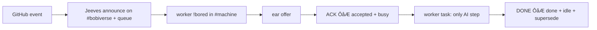

# jeeves-token-less-gate

Seed FR: #23. Headline gate: #1.

Agentic control is an overlay: running this skill helps operators; the gate
itself is script-only and must never require an LLM or a skill.

## The chain (no AI tokens anywhere except the worker's own task)

*Caption: every box is a script except the worker's own work between ACK and DONE.*

Works during a token outage: webhook queue + mandatory `!bored` + addressed
offer + ACK needs no Bob reasoning.

## G1 (CI, every PR)

Local test ircd on loopback, stub receiver, scripted fake worker, no-LLM
process guard; queue and webhook snapshots must match. Never live IRC.
Tests live under `tests/g1_token_less_e2e/` (#1).

## G2 (manual, after deploy)

1. Digest shows Jeeves `lastSeen` fresh; test ear and worker have no token pools.
2. Open issue "smoke <timestamp>" on a sandbox repo  GIT line on `#bobiverse`, FR in `queue.unaccepted`.
3. Worker `!bored`  ear `OFFER FR <repo>#n` to that nick.
4. `ACK FR <repo>#n`  accepted, worker busy with activity.
5. PR with `Closes #n`  FR replaced by MRB.
6. `DONE FR <repo>#n PR <url>`  worker idle, row done.
7. Close PR unmerged  FR restored; close issue  removed.
8. Record in the release notes (`jeeves-release`).
