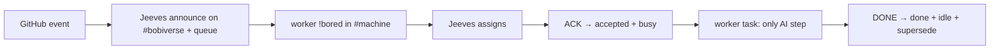

# jeeves-token-less-gate

Seed FR: #23. Headline gate: #1.

## Overlay

**Agentic control is an overlay.** Running this skill helps operators; the gate
itself is **script-only** and must **never** require an LLM or a skill for G1
to pass.

## The chain (no AI tokens anywhere except the worker's own task)



*Caption: every box is a script except the worker's own work between ACK and DONE.*

Works during a token outage: webhook queue + mandatory `!bored` + **Jeeves
assigns** (FR #106) + ACK needs no Bob reasoning.

## G1 (CI, every PR)

Local test ircd on loopback, stub receiver, scripted fake worker, no-LLM
process guard (`jeeves.guard`); queue and webhook snapshots must match. Never
live IRC. Tests live under `tests/g1_token_less_e2e/` (#1) plus cast-iron
checks under `tests/cast_iron/`.

## G2 (manual, after deploy)

Follow `docs/g2-live-smoke-checklist.md`. Summary:

1. Digest shows Jeeves `lastSeen` fresh; test ear and worker have no token pools.
2. Open issue "smoke <timestamp>" on a sandbox repo → GIT line on `#bobiverse`, FR in `queue.unaccepted`.
3. Worker `!bored` → **Jeeves assigns** next job to that nick.
4. `ACK FR <repo>#n` → accepted, worker busy with `working_on`.
5. PR with `Closes #n` → FR replaced by MRB.
6. `DONE …` → worker idle, row done + supersede.
7. Close PR unmerged → FR restored; close issue → removed.
8. Record in the release notes (`jeeves-release`).

## Commands

CI-safe **dry-run** (skill lint + `pytest --collect-only` on G1; no live IRC):

```powershell
python -m jeeves.token_less_gate_tool --dry-run --json
python -m jeeves gate --dry-run --json
```

Run G1 (every PR / before release):

```powershell
pytest -q tests/g1_token_less_e2e tests/cast_iron
```

G2: open `docs/g2-live-smoke-checklist.md` after deploy (`jeeves-release`).

Exit codes for dry-run: `0` ok, `2` skill/collect incomplete.

## Tests

```text
pytest -q tests/test_skill_token_less_gate_fr23.py tests/g1_token_less_e2e
```

Related: `jeeves-release`, `jeeves-health`, `jeeves-queue`.
