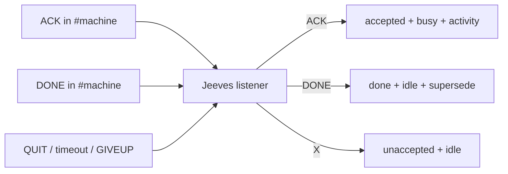

# jeeves-worker-state

Seed FR: #21. Busy/idle comes from shop ACK/DONE that Jeeves records — never
from how a seat's console looks (hidden runs look idle while working).

## Overlay

**Agentic control is an overlay.** The token-less path (brief section 0 / issue #1)
must **never** depend on this skill or an LLM. Scripts own ACK/DONE → webhook.

**K12 / FR #13:** TipForm START tiles read `machines.<id>.working_on` (and
pid `workers.*.working_on`) that Jeeves sets on ACK and clears on DONE.
AgentMonitor hidden `-p` wakes (AgentMonitor #90) may leave the visible TUI
looking idle — the webhook/TipForm is the operator busy signal.

**Worker pack must echo the task in the seat** on ACK (print a clear line such
as `WORKING: FR owner/repo#n` before work) so chat history shows the job even
when the TUI does not reload.

## Source of truth

`GET https://irc.ntsa.uk/bob/v1/report` (digest webhook):

- `machines.<id>`: `nick`, `online`, `lastSeen`, `jobs`, `running`, `queued`,
  `working_on` (**TipForm busy text**), `workers{pid:{working_on, agent, model}}`.
- `queue{unaccepted, accepted, done}`.

## State table

| Shop line (own `#{machine}`) | Queue | Worker | Activity |
|------|-------|--------|----------|
| `!bored` | Jeeves assigns next (`!focus` order) or `<nick>: nothing queued` | unchanged until ACK | — |
| `ACK <TYPE> <repo>#<n>` | unaccepted → accepted | busy | `machines.<id>.working_on` + TipForm START; seat echoes task |
| `DONE <TYPE> <repo>#<n> …` | accepted → done + supersede | idle | `working_on` cleared; worker `!bored` again |
| QUIT / DONE timeout / GIVEUP / NACK | accepted → unaccepted | idle | cleared |



*Caption: Jeeves is the single deterministic writer of worker busy/idle and activity.*

## Commands

CI-safe **dry-run** (skill lint + isolated ACK→busy / DONE→idle TipForm demo;
never mutates the live digest):

```powershell
python -m jeeves.worker_state_tool --dry-run --json
python -m jeeves worker-state --dry-run --json
```

Optional read-only live counts: `--digest-home $env:BOB_DIGEST_HOME`.

Exit codes: `0` ok, `2` skill incomplete.

## Rules

- Idle seats must show **no jobs**: empty `jobs`, `running=0`, `queued=0`,
  empty `working_on`. Counts follow the published `jobs` only.
- A bob-* ear being present is never a coding job; never publish a bare
  `repo: irc` job.
- Each job carries **agent** and **model** when the worker reports them.
- Jeeves must not assign to a worker that is busy / already accepted (FR #106).
- Self-MRB assign only when no other live seat exists.

## Diagnose

1. **Accepted empty after ACK:** nick `{machine}-<pid>` in own `#{machine}`;
   grammar; webhook POST (Jeeves log).
2. **Stuck accepted:** worker gone → return to unaccepted; else `jeeves-queue`
   dry-run / resync.
3. **Stale START tile:** digest empty `working_on` / jobs but TipForm stale —
   TipForm cache (owned elsewhere); republish.
4. **Idle but working:** worker skipped ACK; fix worker pack, not Jeeves.

## Tests

```text
pytest -q tests/test_skill_worker_state_fr21.py tests/test_worker_busy_tipform_k12_fr13.py
```

Related: `jeeves-shop-protocol`, `jeeves-queue`, `jeeves-health`.
