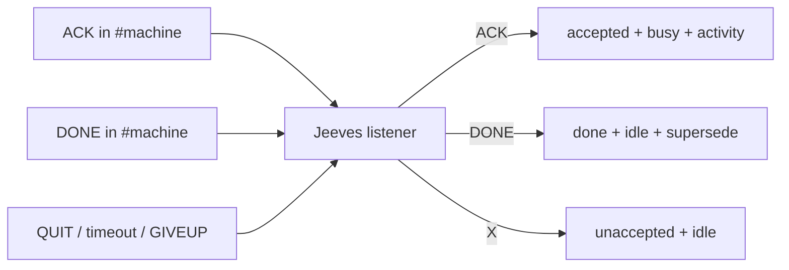

# jeeves-worker-state

Seed FR: #21. Busy/idle comes from shop ACK/DONE that Jeeves records ÔÇö never
from how a seat's console looks (hidden runs look idle while working).

Agentic control is an overlay: the token-less path must never depend on this skill.

## Source of truth

`GET https://{bob-host}/bob/v1/report` (digest webhook):

- `machines.<id>`: `nick`, `online`, `lastSeen`, `jobs`, `running`, `queued`,
  `working_on`, `workers{pid:{working_on, agent, model}}`.
- `queue{unaccepted, accepted, done}`.

## State table

| Shop line (own `#{machine}`) | Queue | Worker | Activity |
|------|-------|--------|----------|
| `ACK <TYPE> <repo>#<n>` | unaccepted  accepted | busy | `<MODE> <repo>#<n> <title>` (TipForm START tile) |
| `DONE <TYPE> <repo>#<n> ` | accepted  done + supersede | idle | cleared |
| QUIT / DONE timeout / GIVEUP / NACK | accepted  unaccepted | idle | cleared |

*Caption: Jeeves is the single deterministic writer of worker busy/idle and activity.*

## Rules

- Idle seats must show **no jobs**: empty `jobs`, `running=0`, `queued=0`,
  empty `working_on`. Counts follow the published `jobs` only.
- A bob-* ear being present is never a coding job; never publish a bare
  `repo: irc` job.
- Each job carries **agent** and **model** when the worker reports them.
- The ear must not offer to a worker that is busy on the webhook.

## Diagnose

1. **Accepted empty after ACK:** check the nick is `{machine}-<pid>` and the
   ACK was in its own `#{machine}`; check the grammar parses; check the webhook
   POST was accepted (Jeeves log).
2. **Stuck accepted:** worker gone (no live nick)  should return to
   unaccepted; if not, run a resync (`jeeves-queue`, dry-run first).
3. **Stale START tile:** confirm the digest shows empty `jobs`; if the digest
   is right, the tile's cache/fingerprint is stale (TipForm, owned elsewhere) ÔÇö
   republish rather than editing the digest by hand.
4. **Idle but working:** the worker skipped ACK; fix the worker pack, not Jeeves.

Related: `jeeves-shop-protocol`, `jeeves-queue`, `jeeves-health`.
