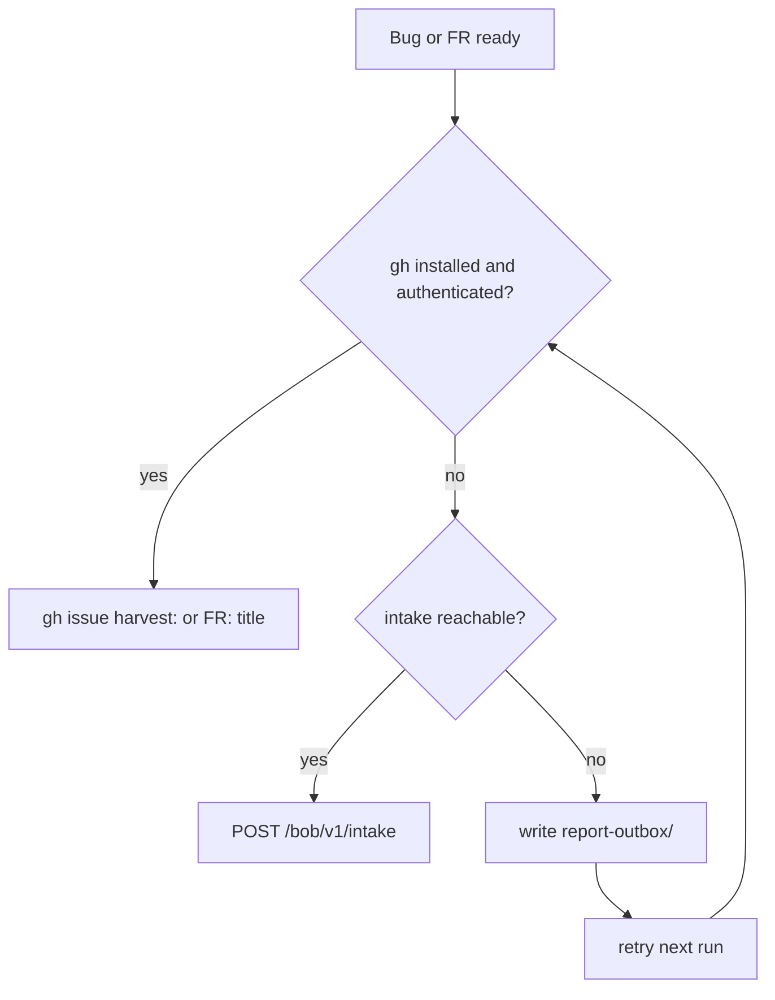

# Report a bug or feature request (no GitHub account)

Use this when skill use surfaces a **bug** or **feature request** and you owe
the home repo a filing — including when the operator has **no GitHub account**
and no authenticated `gh`. This is the honesty-box path for plain issues/FRs
during normal skill use (not only skill-harvest PRs). Harvest playbooks still
use [harvest](../harvest/SKILL.md).

**Home:** `https://github.com/SimonBarnett/gh-Jeeves`. Frontmatter `github:`
MUST stay on this repo.

## Report route (strict order)

Never require anyone to create a GitHub account just to file a bug or FR.



*Caption: prefer `gh`; fall back to Bob webhook intake; if offline, queue locally and retry.*

1. **`gh` available and authenticated** → open a GitHub issue on the target
   allow-listed repo. Title prefix: `harvest:` for bugs/gaps, `FR:` for feature
   requests. Use that repo's issue/FR templates when present.
2. **No `gh`, or not authenticated** → POST to
   `https://{bob-host}/bob/v1/intake` (#26 / #179). No GitHub account needed.
   The service files with label `via-intake` (plus `feature-request` for
   `kind: fr`, and `needs-mrb1` for both issue and fr per #151). Send an
   `idempotency_key` so retries never duplicate.
3. **Offline / intake unreachable** → write the JSON payload to a local
   `report-outbox/` folder and retry it (same `idempotency_key`) on the next
   run. Prefer the helper `write_local_report_outbox` in `jeeves.intake` when
   running from this repo's Python tree.

## Payload (FR #26 schema)

| Field | Required | Notes |
|-------|----------|-------|
| `kind` | yes | `issue` (bug) or `fr` (feature request) |
| `repo` | yes | `owner/name` on the intake allow-list. **Required** — Jeeves never defaults this to `SimonBarnett/bobiverse` (FR #222). File against the product repo the report is about (e.g. `SimonBarnett/agentic_fomprep`). |
| `title` | yes | Short; `FR:` prefix for features |
| `body` | yes | Markdown; no secrets, tokens, or machine IDs |
| `source` | recommended | `machine`, `agent`, `skill_book`, `version` |
| `idempotency_key` | recommended | Stable string; same key → one filing |
| `contact` | optional | Never logged; only in public body if `contact_public` |

Optional fleet key: header `X-Bob-Intake-Key` from env `BOB_INTAKE_KEY` —
never commit or log it.

## Ready snippets (zero AI tokens)

Bug (`kind: issue`) — write `report-issue.json` then:

```bash
curl -sS -X POST "https://{bob-host}/bob/v1/intake" \
  -H "Content-Type: application/json" \
  ${BOB_INTAKE_KEY:+-H "X-Bob-Intake-Key: $BOB_INTAKE_KEY"} \
  -d @report-issue.json
```

```powershell
$h = @{ 'Content-Type' = 'application/json' }
if ($env:BOB_INTAKE_KEY) { $h['X-Bob-Intake-Key'] = $env:BOB_INTAKE_KEY }
Invoke-RestMethod -Method Post -Uri 'https://{bob-host}/bob/v1/intake' `
  -Headers $h -Body (Get-Content report-issue.json -Raw)
```

Example `report-issue.json`:

```json
{
  "kind": "issue",
  "repo": "SimonBarnett/gh-Jeeves",
  "title": "harvest: skill step failed under X",
  "body": "## What broke\n\n...\n\n## Expected\n\n...",
  "source": {
    "machine": "{machine}",
    "agent": "seat",
    "skill_book": "gh-Jeeves",
    "version": ""
  },
  "idempotency_key": "issue-{machine}-stable-slug"
}
```

Feature request (`kind: fr`) — same curl / Invoke-RestMethod against
`report-fr.json`:

```json
{
  "kind": "fr",
  "repo": "SimonBarnett/gh-Jeeves",
  "title": "FR: add Y to skill Z",
  "body": "## Why\n\n...\n\n## What\n\n...",
  "source": {
    "machine": "{machine}",
    "agent": "seat",
    "skill_book": "gh-Jeeves",
    "version": ""
  },
  "idempotency_key": "fr-{machine}-stable-slug"
}
```

Expect `202 {intake_id, url}` or `202 {intake_id, queued:true}`. Status:
`GET /bob/v1/intake/<id>`.

Python helpers (this repo, script-only): `build_report_payload`,
`report_should_use_intake` (same gate as harvest), `write_local_report_outbox`.

## Do not

- Hardcode a live host in this skill — always `{bob-host}`.
- Put secrets, tokens, keys, contact values, or machine IDs in logs or the
  public issue body.
- Invent allow-list repos; a repo not on the list returns **403** `repo_not_allowed` and files nothing (never rewrite to bobiverse).
- Omit `repo` or point every harvest at bobiverse when the work was in another allow-listed product (FR #222 / bobiverse #94). Default allow-list includes `gh-Jeeves`, `bobiverse`, `agentic_fomprep`, `agentic_irc`, `agentic_build`, `skills-visionary`, `AgentMonitor`.
- Stamp ready for human UAT from a report alone.
- Use LLM calls on the filing path — curl / Invoke-RestMethod / `jeeves.intake`
  only.
